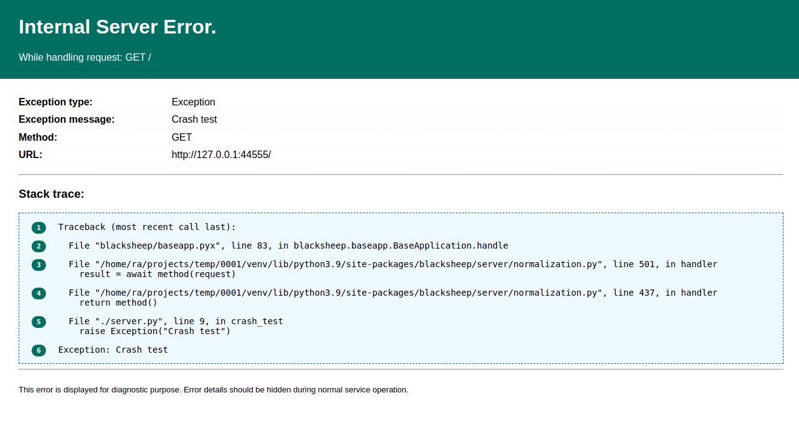
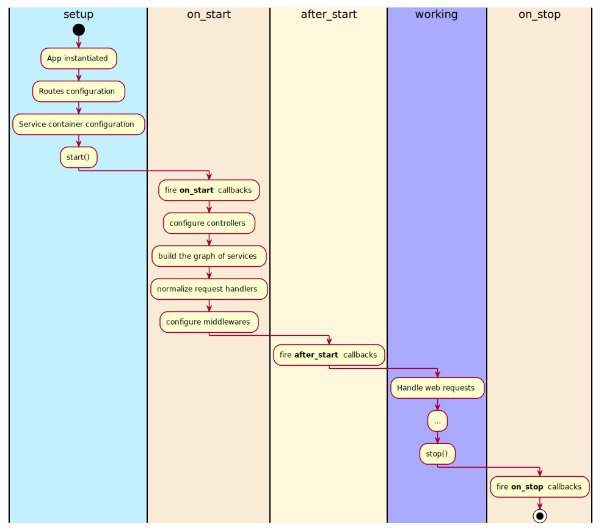

# The Application class
The `Application` class in BlackSheep is responsible for handling the
application life cycle (start, working state, stop), routing, web requests,
and exceptions. This page describes the details of the `Application` class:

- [X] How to handle errors.
- [X] Application events and life cycle.

## Handling errors

BlackSheep catches any unhandled exception that happen during the execution of
request handlers, producing an `HTTP 500 Internal Server Error` response. To see
this in practice, start an application like the following:

```python
from blacksheep import Application, get

app = Application()


@get("/")
def crash_test():
    raise Exception("Crash test")
```

And observe how a request to its root produces a response with HTTP status 500,
and the text "Internal server error".

Exception details are hidden from the client by default: it would be a security
issue if the web application returned error details to the client. However,
while developing and occasionally while investigating issues, it is useful to
be able to obtain error details directly from the web requests that are
failing. To enable error details, update the app declaration as follows:

```python
app = Application(show_error_details=True)
```

Now the application returns the details of the exception with the full stack
trace, serving a page like the following:



/// admonition | Use the `APP_SHOW_ERROR_DETAILS`.
    type: tip

Rather than using the `show_error_details` parameter, it is recommended to use
the environment variable `APP_SHOW_ERROR_DETAILS` to control whether the
application displays detailed error information. Setting
`APP_SHOW_ERROR_DETAILS=1` or `APP_SHOW_ERROR_DETAILS=True` enables this
feature.
///

/// admonition | Settings strategy

BlackSheep project templates include a strategy to handle application
settings and configuration roots. Refer to [_Getting started with the MVC project template_](./mvc-project-template.md)
for more information.
///

## EnvironmentSettings

/// admonition | New in BlackSheep 2.4.4
    type: info

Starting from BlackSheep 2.4.4, the `Application` object includes an `env_settings` property that provides runtime access to environment-based configuration settings.

///

The `Application` object automatically attaches an `EnvironmentSettings` instance that contains configuration values read from environment variables. This feature provides transparency and enables runtime inspection of the application's configuration, which is useful for debugging, testing, and administrative purposes.

### Accessing Environment Settings

You can access the environment settings through the `env_settings` property:

```python
from blacksheep import Application

app = Application()

# Access environment settings at runtime
print(f"Show error details: {app.env_settings.show_error_details}")
print(f"Force HTTPS: {app.env_settings.force_https}")
print(f"HTTP scheme: {app.env_settings.http_scheme}")
```

### Available Environment Settings

The `EnvironmentSettings` object includes the following properties (all read-only):

| Property             | Environment Variable     | Type         | Description                                   |
| -------------------- | ------------------------ | ------------ | --------------------------------------------- |
| `show_error_details` | `APP_SHOW_ERROR_DETAILS` | `bool`       | Whether to display detailed error information |
| `force_https`        | `APP_FORCE_HTTPS`        | `bool`       | Whether to force HTTPS scheme and enable HSTS |
| `http_scheme`        | `APP_HTTP_SCHEME`        | `str | None` | Explicitly set request scheme (`http` or `https`) |

### Practical Use Cases

#### Testing and Assertions

Environment settings are particularly useful for testing configuration:

```python
import os
from blacksheep import Application

# Set environment variable
os.environ["APP_FORCE_HTTPS"] = "true"

app = Application()

# Assert configuration in tests
assert app.env_settings.force_https is True
assert app.env_settings.http_scheme is None  # Not set

# Clean up
del os.environ["APP_FORCE_HTTPS"]
```

#### Health Check Endpoints

Create health check endpoints that expose configuration information:

```python
from blacksheep import Application, get

app = Application()

@get("/health")
async def health_check():
    return {
        "status": "healthy",
        "config": {
            "force_https": app.env_settings.force_https,
            "http_scheme": app.env_settings.http_scheme,
            "show_error_details": app.env_settings.show_error_details
        }
    }
```

#### Admin Tools and Configuration Inspection

Build administrative interfaces that display current configuration:

```python
from blacksheep import Application, get
from blacksheep.server.authorization import auth

app = Application()

@auth(roles=["admin"])
@get("/admin/config")
async def admin_config():
    """Administrative endpoint to inspect application configuration"""
    return {
        "environment_settings": {
            "show_error_details": app.env_settings.show_error_details,
            "force_https": app.env_settings.force_https,
            "http_scheme": app.env_settings.http_scheme,
        },
        "runtime_info": {
            "debug_mode": app.debug,
            "middleware_count": len(app.middlewares),
        }
    }
```

#### Debugging and Development

Use environment settings for conditional debugging logic:

```python
from blacksheep import Application

app = Application()

@app.on_start
async def configure_logging():
    if app.env_settings.show_error_details:
        # Enable verbose logging in development
        import logging
        logging.getLogger().setLevel(logging.DEBUG)
        print("Debug logging enabled due to APP_SHOW_ERROR_DETAILS=true")
```

### Benefits of Runtime Configuration Access

1. **Transparency**: Easy inspection of how the application is configured
2. **Testing**: Reliable assertions about configuration state in tests
3. **Debugging**: Quick access to configuration values during development
4. **Monitoring**: Health checks and admin endpoints can expose configuration
5. **Conditional Logic**: Runtime decisions based on configuration values

The `EnvironmentSettings` object is read-only, ensuring that configuration remains stable throughout the application lifecycle while still providing full visibility into the current settings.

### Configuring exceptions handlers

The BlackSheep `Application` object has an `exceptions_handlers` dictionary
that defines how errors should be handled. When an exception happens while
handling a web request and reaches the application, the application checks if
there is a matching handler for that kind of exception. An exception handler is
defined as a function with the following signature:

```python {hl_lines="3"}
from blacksheep import Request, Response, text

async def exception_handler(self, request: Request, exc: Exception) -> Response:
    pass
```

```python

class CustomException(Exception):
    pass

async def exception_handler(self, request, exc: CustomException):
    nonlocal app
    assert self is app
    assert isinstance(exc, CustomException)
    return text("Called")


# Register the exception handler for the CustomException type:
app.exceptions_handlers[CustomException] = exception_handler


@get('/')
async def home(request):
    # of course, the exception can be raised at any point
    # for example in the business logic layer
    raise CustomException()

```

Exceptions inheriting from `HTTPException` can be mapped to handlers by their
type or by their status code, using `int` keys; while user-defined exceptions
are mapped to handlers by their type.

When an exception handler is registered for a type of exception, all subclasses
are also handled by that handler. It is however possible to define a more
specific handler for one of the descendant classes.

### Configuring exception handlers using decorators

It is also possible to register exception handlers using decorators, instead
of interacting with `app.exceptions_handlers` dictionary:

```python {hl_lines="5"}
class CustomException(Exception):
    pass


@app.exception_handler(CustomException)
async def handler_example(self, request, exc: CustomException):
    ...

```

### Overriding the default exception handler for unhandled exceptions

To override how unhandled exceptions are handled, define a custom `Application`
class overriding its `handle_internal_server_error` method, like in the
following example:

```python {hl_lines="5-6"}
from blacksheep import Application, json
from blacksheep.messages import Request


class MyApp(Application):
    async def handle_internal_server_error(self, request: Request, exc: Exception):
        # TODO: handle this as you wish!
        return json({"message": "Oh, no!"}, 500)
```

---

## Application events

A BlackSheep application exposes three events: **on_start**, **after_start**,
**on_stop**. These events can be used to configure callbacks and services that
depend on the application lifecycle. The application class also offers a useful
method to configure objects that need to be initialized when the application
starts, and disposed of when the application stops: **lifespan**.

### Using the lifespan decorator

The `Application.lifespan` method can be used to register objects bound to the
application life cycle. Common examples of such objects are HTTP clients and
database clients, since they use connection pools that can be initialized
and must be disposed of when the application stops.

The following example illustrates how to use the `@app.lifespan` decorator to
create an HTTP `ClientSession` that will be disposed of when the application
stops. Note how the instance of `ClientSession` is also bound to application
services, so that it can be injected into request handlers that need it.

```python {linenums="1" hl_lines="9-10 16"}
import asyncio
from blacksheep import Application
from blacksheep.client.pool import ClientConnectionPools
from blacksheep.client.session import ClientSession

app = Application()


@app.lifespan
async def register_http_client():
    async with ClientSession(
        pools=ClientConnectionPools(asyncio.get_running_loop())
    ) as client:
        print("HTTP client created and registered as singleton")
        app.services.register(ClientSession, instance=client)
        yield

    print("HTTP client disposed of")


@router.get("/")
async def home(http_client: ClientSession):
    print(http_client)
    return {"ok": True, "client_instance_id": id(http_client)}


if __name__ == "__main__":
    import uvicorn

    uvicorn.run(app, host="127.0.0.1", port=44777, log_level="debug", lifespan="on")
```

- The code before the `yield` statement (lines _11-16_) is executed when the
  application starts.
- The code after the `yield` statement (lines _17-18_) is executed when the
  application stops.

/// admonition | @app.lifespan

This method leverages `contextlib.asynccontextmanager`. What is defined
before the `yield` statement executes when the application starts, and what
is defined after the `yield` statement executes when the application stops.

///

The following example illustrates how a `redis-py` [connection can be disposed
of](https://redis.readthedocs.io/en/stable/examples/asyncio_examples.html)
using `@app.lifespan`:

```python
import redis.asyncio as redis

...

@app.lifespan
async def configure_redis():
    """
    Configure an async Redis client, and dispose of its connections when the
    application stops.
    See:
    https://redis.readthedocs.io/en/stable/examples/asyncio_examples.html
    """
    connection = redis.Redis()
    print(f"Ping successful: {await connection.ping()}")

    app.services.register(redis.Redis, instance=connection)

    yield connection

    print("Disposing the Redis connection pool...")
    await connection.close()
```

### on_start

This event should be used to configure components such as new request handlers
and services registered in `app.services`, including database connection pools
and HTTP client sessions.

### after_start

This event should be used to configure tasks that must occur after request
handlers are normalized. At this stage, the application router contains
information about the actual routes handled by the web application, allowing
routes to be inspected. For example, the built-in OpenAPI documentation
generation creates the API specification file at this point.

/// admonition | Example: inspecting routes.
    type: tip

An `after_start` callback that prints all routes registered in the application
router:

```python
@app.after_start
async def after_start_print_routes(application: Application) -> None:
    print(application.router.routes)
```
///

### on_stop

This event should be used to trigger callbacks that need to run when the
application stops. For example, it can be used to dispose of services that
require cleanup, such as database connection pools and HTTP client sessions
using connection pools.

### Application life cycle

Refer to the following diagram to know more about when application events
are fired, and the state of the application when they are executed.



### How to register event handlers

=== "Using decorators"
    Event handlers can be registered using decorators.

    ```python
    from blacksheep import Application, Request, Response, text, get


    app = Application()


    @get("/")
    async def home(request: Request) -> Response:
        return text("Example Async")


    @app.on_start
    async def on_start(application: Application) -> None:
        print("On start")


    @app.after_start
    async def after_start(application: Application) -> None:
        print("After start")


    @app.on_stop
    async def on_stop(application: Application) -> None:
        print("On stop")

    ```

=== "Using +="
    In alternative to decorators, event handlers can be registered using ` += `:

    ```python
    from blacksheep import Application, Request, Response, text, get


    app = Application()


    @get("/")
    async def home(request: Request) -> Response:
        return text("Example Async")


    async def before_start(application: Application) -> None:
        print("Before start")


    async def after_start(application: Application) -> None:
        print("After start")


    async def on_stop(application: Application) -> None:
        print("On stop")


    app.on_start += before_start
    app.after_start += after_start
    app.on_stop += on_stop
    ```

## Next

Read about the details of [routing in BlackSheep](routing.md).
