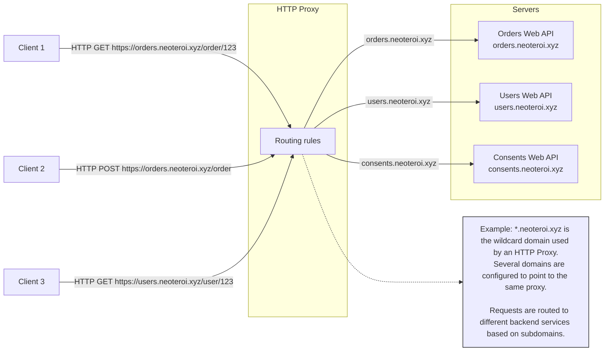
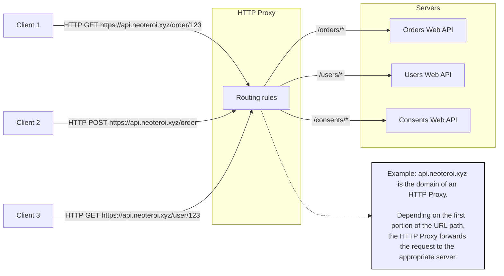
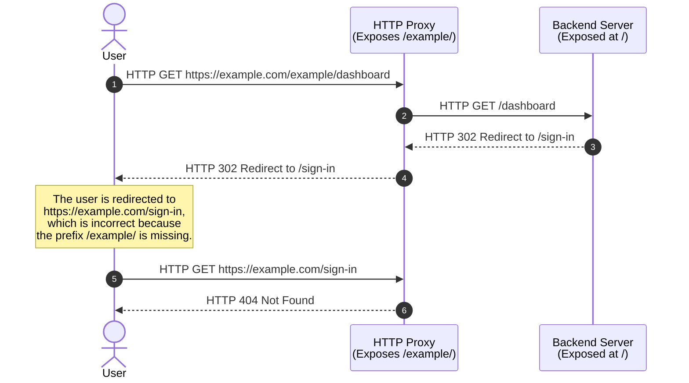
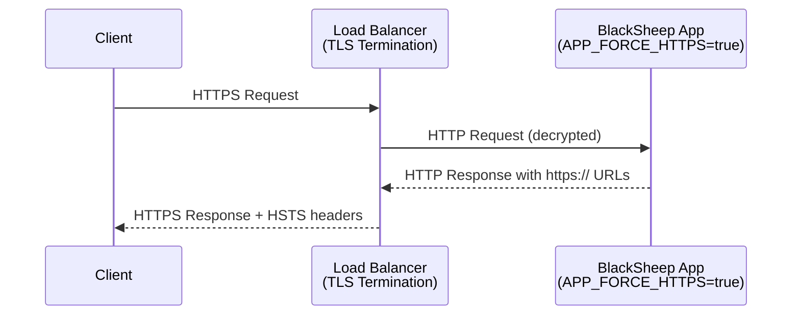

Production web applications are commonly deployed behind HTTP proxies. While
many modern web services use cloud platforms that abstract away the need to
manage HTTP proxies, there are still scenarios where managing load balancing
and proxy rules is necessary. This is especially true when deploying
applications using platforms like [Kubernetes](https://kubernetes.io/).

Deploying web applications behind proxies often requires configuring routing
based on the properties of incoming web requests. The most common examples
include routing based on the HTTP **host** header, the prefix of the **URL
path**, or a combination of both.

This page provides an overview of the features provided by BlackSheep to handle
these scenarios.

### Routing based on hostnames



Routing based solely on the **host** header generally does not introduce
complications for backend web applications. However, it does require additional
maintenance to manage multiple domain names and TLS settings, and routing
rules.

### Routing based on paths

Path-based routing allows a proxy server to forward requests to different
backend services based on a prefix of the URL path. This is particularly useful
when hosting multiple applications or services under the same domain.



When deploying behind proxies in this manner, it is crucial to ensure that the
application properly handles being exposed at a specific path. While this works
well for most REST APIs, it can lead to complications with redirects and for
applications that include user interfaces.

The following diagram illustrates the problem of redirects, if the path prefix
is not handled properly.



/// details | The example of API Gateways
    type: info

API Gateways like [AWS API Gateway](https://docs.aws.amazon.com/prescriptive-guidance/latest/cloud-design-patterns/api-routing-path.html)
and [Azure API Management](https://learn.microsoft.com/en-us/azure/api-management/api-management-key-concepts)
use path based routing to expose many APIs behind the same domain name.
Path based routing generally does not cause complications for REST APIs, but
likely causes complications for web apps serving HTML documents and
implementing interactive sign-in.

///

---

BlackSheep offers two ways to deal with this scenario:

- One approach, defined by the `ASGI` specification, involves specifying a
  `root_path` in the `ASGI` server. This information is passed in the scope of
  web requests. This method is ideal for those who prefer not to modify the
  path at which web servers handle requests, and to configure the proxy server
  to strip the extra prefix when forwarding requests to backend services
  (applying URL rewrite).
- The second approach involves configuring a prefix in the application router
  to globally change the prefix of all request handlers. The global prefix can
  be set when instantiating the `Router` or using the environment variable
  `APP_ROUTE_PREFIX`. This method assumes that modifying the path handled by
  the web server is desirable to align it with the path handled by the HTTP
  proxy server, and it is ideal when applying URL rewrite is not easy.

For both options, BlackSheep handles the information provided by `root_path`
and the application router prefix in some specific ways.
For example, the `get_absolute_url_to_path` defined in `blacksheep.messages`
will handle the information and return an absolute URL to the server
according to both scenarios.

| Feature                                        | Description                                                                                                                                                      |
| ---------------------------------------------- | ---------------------------------------------------------------------------------------------------------------------------------------------------------------- |
| `request.base_path`                            | Returns the `base_path` of a web request, when the ASGI scope includes a `root_path`, or a route prefix is used.                                                 |
| `blacksheep.messages.get_absolute_url_to_path` | Returns an absolute URL path to a given destination, including the current `root_path` or route prefix. Useful when working with redirects.                      |
| `HTTPSchemeMiddleware`                         | Since version `2.4.4`, automatically configures request scheme for TLS termination scenarios using `APP_FORCE_HTTPS` or `APP_HTTP_SCHEME` environment variables. |
| OpenAPI Documentation                          | Since version `2.1.0`, it uses relative links to serve the OpenAPI Specification files (YAML and JSON), and relative paths to support any path prefix.           |

/// details | Jinja2 template helper
    type: tip

The BlackSheep MVC template includes an example of helper function to
[render absolute paths](https://github.com/Neoteroi/BlackSheep-MVC/blob/88b0672a0696d4bef4775203fae086173fd9b0fc/%7B%7Bcookiecutter.project_name%7D%7D/app/templating.py#L26)
in Jinja templates.

///

## HTTPS Scheme Configuration

/// admonition | New in BlackSheep 2.4.4
    type: info

Starting from BlackSheep 2.4.4, BlackSheep provides automatic scheme configuration for applications running behind reverse proxies or load balancers with TLS termination.

///

When applications run behind reverse proxies or load balancers that handle TLS termination, the backend application receives HTTP requests even though clients connect via HTTPS. This can cause issues with:

- **URL generation**: Links and redirects may use `http://` instead of `https://`
- **OpenID Connect flows**: Authentication redirects require correct scheme URLs
- **Security headers**: HSTS headers may not be applied appropriately
- **Cookie security**: Secure cookies may not work properly

### Automatic Scheme Configuration

BlackSheep automatically configures request scheme handling based on environment variables. This feature is applied during application startup when specific environment variables are detected.

#### Force HTTPS with HSTS

To force all requests to use HTTPS scheme and automatically enable HSTS (HTTP Strict Transport Security) headers:

```bash
# Environment variable
APP_FORCE_HTTPS=true
```

```python
from blacksheep import Application, get

app = Application()

# When APP_FORCE_HTTPS=true, BlackSheep automatically:
# 1. Sets request.scheme = "https" for all requests
# 2. Adds HSTS middleware for security headers
# 3. Ensures proper URL generation in proxied environments

@get("/redirect-example")
async def redirect_example(request):
    # This will generate https:// URLs even if the backend receives http://
    redirect_url = request.url.replace(path="/dashboard")
    return redirect(redirect_url)
```

#### Explicit Scheme Configuration

To explicitly set the request scheme without enabling HSTS:

```bash
# Force HTTPS scheme
APP_HTTP_SCHEME=https

# Or force HTTP scheme (for development)
APP_HTTP_SCHEME=http
```

```python
from blacksheep import Application, get

app = Application()

# When APP_HTTP_SCHEME is set, BlackSheep automatically:
# - Sets request.scheme to the specified value
# - Does NOT add HSTS headers (unlike APP_FORCE_HTTPS)

@get("/api/info")
async def api_info(request):
    return {
        "scheme": request.scheme,  # Will be "https" if APP_HTTP_SCHEME=https
        "host": request.host,
        "url": str(request.url)
    }
```

### Manual HTTPSchemeMiddleware

For more control, you can manually configure the `HTTPSchemeMiddleware`:

```python
from blacksheep import Application
from blacksheep.server.remotes.scheme import HTTPSchemeMiddleware
from blacksheep.middlewares import MiddlewareCategory

app = Application()

# Manual configuration
app.middlewares.append(
    HTTPSchemeMiddleware("https"),
    category=MiddlewareCategory.INIT,
    priority=-100  # Execute early in the middleware chain
)

@get("/manual-config")
async def manual_config_example(request):
    # request.scheme will always be "https"
    return {"configured_scheme": request.scheme}
```

### Environment Variable Priority

When both environment variables are set, `APP_FORCE_HTTPS` takes precedence over `APP_HTTP_SCHEME`:

```bash
# This configuration will use APP_FORCE_HTTPS
APP_FORCE_HTTPS=true
APP_HTTP_SCHEME=http  # This is ignored
```

| Environment Variable    | Behavior                   | HSTS Headers  | Use Case                        |
| ----------------------- | -------------------------- | ------------- | ------------------------------- |
| `APP_FORCE_HTTPS=true`  | Forces HTTPS scheme        | ✅ Enabled     | Production with TLS termination |
| `APP_HTTP_SCHEME=https` | Forces HTTPS scheme        | ❌ Not enabled | Custom HTTPS setup              |
| `APP_HTTP_SCHEME=http`  | Forces HTTP scheme         | ❌ Not enabled | Development/testing             |
| Neither set             | Uses actual request scheme | ❌ Not enabled | Default behavior                |

### Use Cases and Benefits

#### 1. Load Balancers with TLS Termination



#### 2. OpenID Connect Integration

```python
from blacksheep import Application
from blacksheep.server.openid.oidc import OpenIDSettings

# With APP_FORCE_HTTPS=true, OpenID Connect redirects work correctly
app = Application()

# OpenID Connect will generate correct https:// redirect URLs
oidc_settings = OpenIDSettings(
    authority="https://your-authority.com",
    client_id="your-client-id",
    # redirect_uri will automatically use https:// scheme
)
```

#### 3. API Gateway Deployments

```python
# Deployment behind AWS API Gateway, Azure API Management, etc.
# Set APP_FORCE_HTTPS=true to ensure proper URL generation

from blacksheep import Application, get

app = Application()

@get("/api/resource/{id}")
async def get_resource(request, id: str):
    # Generate links to other resources with correct scheme
    base_url = request.url.replace(path="")
    return {
        "id": id,
        "self": f"{base_url}/api/resource/{id}",
        "related": f"{base_url}/api/resource/{id}/related"
    }
```

### Configuration in Application Settings

Access the current scheme configuration through the application's environment settings:

```python
from blacksheep import Application

app = Application()

@app.on_start
async def log_configuration():
    print(f"Force HTTPS: {app.env_settings.force_https}")
    print(f"HTTP Scheme: {app.env_settings.http_scheme}")

    if app.env_settings.force_https:
        print("🔒 HTTPS enforcement and HSTS headers enabled")
    elif app.env_settings.http_scheme:
        print(f"🔧 Scheme forced to: {app.env_settings.http_scheme}")
    else:
        print("ℹ️  Using actual request scheme")
```

### Troubleshooting

**Problem**: URLs still generate with `http://` scheme

**Solution**: Ensure the environment variable is set correctly:

```bash
# Check if the variable is set
echo $APP_FORCE_HTTPS

# Set it correctly (case-sensitive)
export APP_FORCE_HTTPS=true
# or
export APP_FORCE_HTTPS=1
```

**Problem**: HSTS headers not appearing

**Solution**: Use `APP_FORCE_HTTPS` instead of `APP_HTTP_SCHEME` for automatic HSTS:

```bash
# This enables HSTS
APP_FORCE_HTTPS=true

# This does NOT enable HSTS
APP_HTTP_SCHEME=https
```

**Problem**: Scheme middleware not applying

**Solution**: The middleware is only applied automatically when environment variables are detected at startup. Check the application startup logs or environment settings:

```python
# Verify configuration is detected
print(f"App env settings: {app.env_settings.__dict__}")
```
