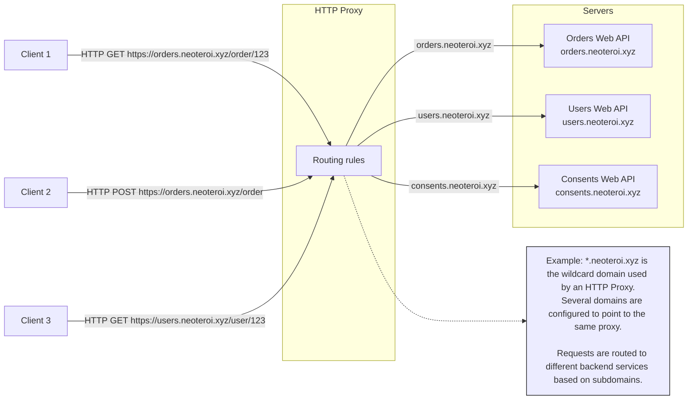
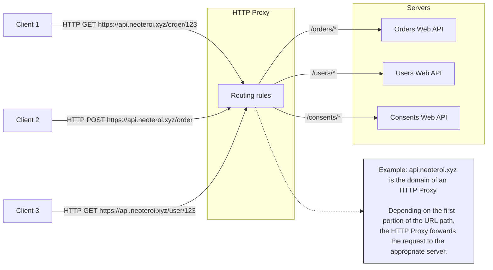
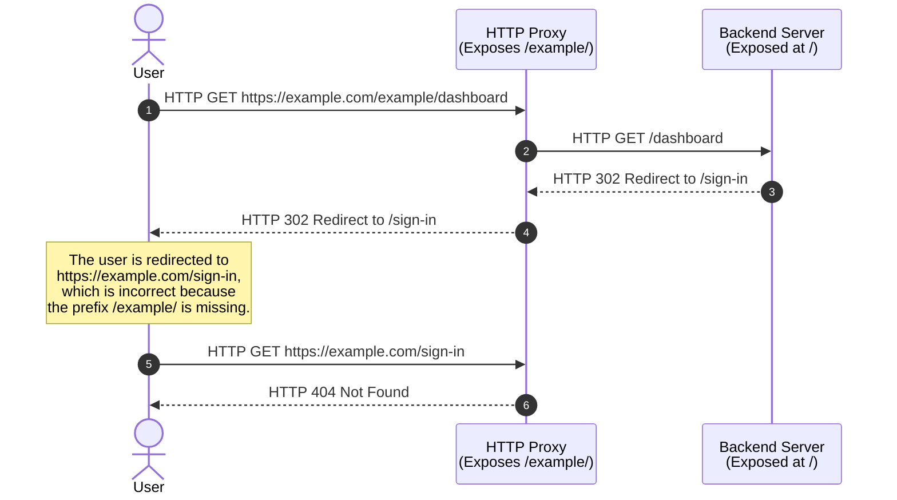

Production web applications are commonly deployed behind HTTP proxies. While
many modern web services use cloud platforms that abstract away the need to
manage HTTP proxies, there are still scenarios where managing load balancing
and proxy rules is necessary. This is especially true when deploying
applications using platforms like [Kubernetes](https://kubernetes.io/).

Deploying web applications behind proxies often requires configuring routing
based on the properties of incoming web requests. The most common examples
include routing based on the HTTP **host** header, the prefix of the **URL
path**, or a combination of both.

This page provides an overview of the features provided by BlackSheep to handle
these scenarios.

### Routing based on hostnames

Routing based solely on the **host** header generally does not introduce
complications for backend web applications. However, it does require additional
maintenance to manage multiple domain names and TLS settings, and routing
rules.

### Routing based on paths

Path-based routing allows a proxy server to forward requests to different
backend services based on a prefix of the URL path. This is particularly useful
when hosting multiple applications or services under the same domain.

When deploying behind proxies in this manner, it is crucial to ensure that the
application properly handles being exposed at a specific path. While this works
well for most REST APIs, it can lead to complications with redirects and for
applications that include user interfaces.

The following diagram illustrates the problem of redirects, if the path prefix
is not handled properly.

/// details | The example of API Gateway
    type: info

API Gateways like [AWS API Gateway](https://docs.aws.amazon.com/prescriptive-guidance/latest/cloud-design-patterns/api-routing-path.html)
and [Azure API Management](https://learn.microsoft.com/en-us/azure/api-management/api-management-key-concepts)
use path based routing to expose many APIs behind the same domain name.
Path based routing generally does not cause complications for REST APIs, but
likely causes complications for web apps serving HTML documents and
implementing interactive sign-in.

///

---

`BlackSheep` offers two ways to deal with this scenario:

- One approach, defined by the `ASGI` specification, involves specifying a
  `root_path` in the `ASGI` server. This information is passed in the scope of
  web requests. This method is ideal for those who prefer not to modify the
  path at which web servers handle requests, and to configure the proxy server
  to strip the extra prefix when forwarding requests to backend services
  (applying URL rewrite).
- The second approach involves configuring a prefix in the application router
  to globally change the prefix of all request handlers. The global prefix can
  also be set using the environment variable `APP_ROUTE_PREFIX`. This method
  assumes that modifying the path handled by the web server is desirable to
  align it with the path handled by the HTTP proxy server, and it is ideal
  when using URL rewrite is not easy.

For both options, `BlackSheep` handles the information provided by `root_path`
or the application router prefix in some specific ways.
For example, the `get_absolute_url_to_path` defined in `blacksheep.messages`
will handle the information and return an absolute URL to the server
according to both scenarios.

| Feature                                        | Description                                                                                                                                            |
| ---------------------------------------------- | ------------------------------------------------------------------------------------------------------------------------------------------------------ |
| `request.base_path`                            | Returns the `base_path` of a web request, when the ASGI scope includes a `root_path`, or a route prefix is used.                                       |
| `blacksheep.messages.get_absolute_url_to_path` | Returns an absolute URL path to a given destination, including the current `root_path` or route prefix. Useful when working with redirects.            |
| OpenAPI Documentation                          | Since version `2.1.0`, it uses relative links to serve the OpenAPI Specification files (YAML and JSON), and relative paths to support any path prefix. |

/// details | Jinja2 template helper
    type: tip

The BlackSheep MVC template includes an example of helper function to
[render absolute paths](https://github.com/Neoteroi/BlackSheep-MVC/blob/88b0672a0696d4bef4775203fae086173fd9b0fc/%7B%7Bcookiecutter.project_name%7D%7D/app/templating.py#L26)
in Jinja templates.

///
