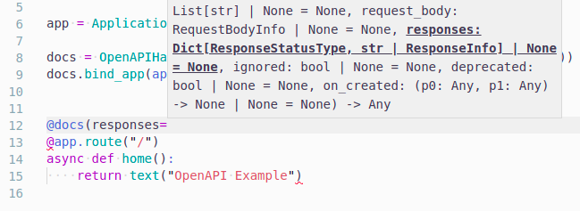

# Contributing to BlackSheep

This page describes how to contribute to BlackSheep. Most of the information
presented here applies also to other projects from
[`Neoteroi`](https://github.com/Neoteroi) (e.g.
[rodi](https://github.com/Neoteroi/rodi),
[guardpost](https://github.com/Neoteroi/guardpost),
[essentials-openapi](https://github.com/Neoteroi/essentials-openapi)), although
among these projects, only BlackSheep is using `Cython`.

## System requirements

Building `blacksheep` locally requires the following:

* one of the supported [Python](https://www.python.org/downloads/) versions; it
  is recommended to use one of the latest two stable versions (e.g. Python 3.8
  or 3.9 as of the 1st of May 2021)
* a `C` compiler, required to use
  [Cython](https://cython.readthedocs.io/en/latest/src/quickstart/install.html)
  (refer to Cython's documentation for more information on this subject)

## Preparing a development environment

1. fork the [main repository in GitHub](https://github.com/Neoteroi/BlackSheep)
1. clone the forked repository
1. create a Python virtual environment in the desired location (`.gitignores`
   is configured to ignore a `venv` folder, so if you name your virtual
   environment this way, you can comfortably keep the virtual environment in
   the same folder of the repository)
1. install the dependencies that are required to develop, listed in
   `requirements.txt` <br />(_pip install -r requirements.txt_)
1. compile the `C` extensions: if your system supports `Makefile`, use
   `make compile`; otherwise run manually the commands described in the
   `Makefile` for `cyt` and `compile` commands
1. run the unit tests to verify if things were compiled correctly, using
   `pytest` or `make test`

Watch the following video for instructions:

<a href="https://youtu.be/DgRVCXfv0aM" title="How to build BlackSheep" target="_blank">

</a>

## Formatters and style enforcement

BlackSheep uses the following tools for code formatting:

* [`flake8`](https://flake8.pycqa.org/en/latest/)
* [`black`](https://github.com/psf/black)
* [`isort`](https://github.com/PyCQA/isort)

`flake8`, `black`, and `isort` are used in the CI pipeline as a
required step for successful build completion.
The repository includes configuration files for `flake8` and `black`.

The provided `Makefile` defines a task to run linters:

* `make lint` - to run flake8, isort, and black validation

## Type hints

BlackSheep aims at being type friendly, meaning:

* most functions, especially those whose arguments are not obvious, should be
  type annotated
* when developers work with popular text editors and IDEs like `PyCharm` or
  `Visual Studio Code`, they should benefit from proper help / auto-completion
  of parameters required by functions and constructors
* the parts coded in `Cython` are documented using stub files (`.pyi`), see
  [PEP
  484](https://www.python.org/dev/peps/pep-0484/#storing-and-distributing-stub-files)
* the code should be generally respectful of
  [`MyPy`](https://mypy.readthedocs.io/en/stable/index.html) and, when `Visual
  Studio Code` is used,
  [`Pylance`](https://marketplace.visualstudio.com/items?itemName=ms-python.vscode-pylance)

This being said, `blacksheep` doesn't aim at 100% typing coverage or full
adherence to `MyPy`'s (or `pyright/Pylance`'s) notions of typing perfection.
The most important thing is for **features** to work as intended and well (good
enough!), and to be fully test-covered.



## Code coverage

BlackSheep features 100% code coverage, except for some rare cases where
`#pragma: no cover` is used. New contributions should not decrease code
coverage, unless there is a good reason to skip lines. Integration with
[`Codecov`](https://app.codecov.io/gh/Neoteroi/BlackSheep) checks code coverage
in pull requests.

[](https://codecov.io/gh/Neoteroi/BlackSheep)

To create code coverage:

```bash
make test-cov
```

Or, for those who cannot use `make`:

```bash
pytest --cov-report html --cov=blacksheep
```

## How to name branches

It doesn't matter, as long as branch names don't contain anything that violates
the _Code of Conduct_ included in the project's repository. As a general rule
of thumb, branch names should have a descriptive name, or refer to the number
of an issue in their name (e.g. `fix_102`).

## setup.py

It is the intention of `blacksheep`'s author to always keep `setup.py` files as
stupid and simple as possible. So please don't modify the `setup.py` file to
be "smarter" or more dynamic without prior discussion in an issue.

## How to develop and debug with Visual Studio Code

The following video shows I am using [Visual Studio Code](https://code.visualstudio.com)
to work on BlackSheep:

<a href="https://youtu.be/ypnT408sEVY" title="Using Visual Studio Code" target="_blank">

</a>
