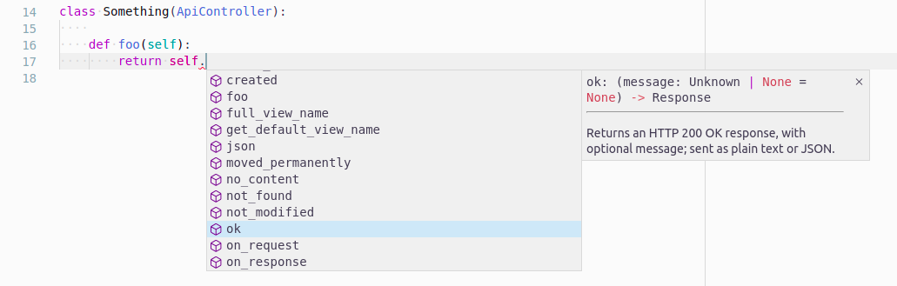

# Controllers

BlackSheep includes built-in features to support the MVC (Model, View,
Controller) architecture. A `Controller` is a class with at least one method
registered as a request handler (i.e., associated with a route). A Controller
is instantiated for each web request when the request matches a route defined
in that controller.

This page describes:

- [X] Controller methods.
- [X] API Controllers.
- [X] Controllers inheritance.

It is recommended to follow the [MVC tutorial](mvc-project-template.md) before
reading this page.

/// admonition | For Flask users.
    type: tip

If you come from Flask, controllers in BlackSheep can be considered
equivalent to Flask's Blueprints, as they allow to group request handlers
in dedicated modules and classes.

///

## The Controller class

Controllers implement several methods to simplify returning responses. These
are the same described in [Responses](responses.md), but they can be overridden
in subclasses of `Controller` and they remove the need to import functions.

| Method                 | Description                                                                                                                                                                                                       |
| ---------------------- | ----------------------------------------------------------------------------------------------------------------------------------------------------------------------------------------------------------------- |
| **ok**                 | Returns an HTTP 200 OK response, with an optional message; sent as plain text or JSON.                                                                                                                            |
| **status_code**        | Returns a plain response with the given status, and with an optional message; sent as plain text or JSON.                                                                                                         |
| **created**            | Returns an HTTP 201 Created response, to the given location and with optional JSON content.                                                                                                                       |
| **accepted**           | Returns an HTTP 202 Accepted response, with an optional message; sent as plain text or JSON.                                                                                                                      |
| **no_content**         | Returns an HTTP 204 No Content response.                                                                                                                                                                          |
| **json**               | Returns a response with application/json content, and the given status (default HTTP 200 OK).                                                                                                                     |
| **pretty_json**        | Returns a response with indented application/json content, and the given status (default HTTP 200 OK).                                                                                                            |
| **text**               | Returns a response with text/plain content, and the given status (default HTTP 200 OK).                                                                                                                           |
| **html**               | Returns a response with text/html content, and the given status (default HTTP 200 OK).                                                                                                                            |
| **moved_permanently**  | Returns an HTTP 301 Moved Permanently response, to the given location.                                                                                                                                            |
| **redirect**           | Returns an HTTP 302 Found response (commonly called redirect), to the given location.                                                                                                                             |
| **see_other**          | Returns an HTTP 303 See Other response, to the given location.                                                                                                                                                    |
| **not_modified**       | Returns an HTTP 304 Not Modified response.                                                                                                                                                                        |
| **temporary_redirect** | Returns an HTTP 307 Temporary Redirect response, to the given location.                                                                                                                                           |
| **permanent_redirect** | Returns an HTTP 308 Permanent Redirect response, to the given location.                                                                                                                                           |
| **bad_request**        | Returns an HTTP 400 Bad Request response, with an optional message; sent as plain text or JSON.                                                                                                                   |
| **unauthorized**       | Returns an HTTP 401 Unauthorized response, with an optional message; sent as plain text or JSON.                                                                                                                  |
| **forbidden**          | Returns an HTTP 403 Forbidden response, with an optional message; sent as plain text or JSON.                                                                                                                     |
| **not_found**          | Returns an HTTP 404 Not Found response, with an optional message; sent as plain text or JSON.                                                                                                                     |
| **view**               | Returns a view rendered synchronously.                                                                                                                                                                            |
| **view_async**         | Returns a view rendered asynchronously.                                                                                                                                                                           |
| **file**               | Returns a binary file response with the given content type and optional file name, for download (attachment) (default HTTP 200 OK). This method supports being called with bytes, or a generator yielding chunks. |

For information on how to use these methods, refer to the type annotations
provided in the code.



!!! info
    Using an IDE like JetBrains PyCharm, or Visual Studio Code (as in
    the screenshot above), enables automatic completion and hints thanks to type
    annotations.

### on_request and on_response

Using controllers it is possible to define methods that are always executed
before handling a request and after producing a response:

```python
class Example(Controller):

    async def on_request(self, request: Request):
        print("Received a request!")

    async def on_response(self, response: Response):
        print("Produced response!")
```

Using controllers involves a performance fee compared to using functions because
a controller must be instantiated at each web request, but has the following
benefits:

* Controllers support [dependency injection](dependency-injection.md) to
  receive services for their constructors, in addition to [dependency
  injection](dependency-injection.md) for every single request handler
* Controllers support defining an `on_request(request: Request)` method, that
  gets called at every web request, `on_response(response: Response)` method,
  and a base `route` (defined as class method) for all handlers defined in the
  class.
* Controllers provide methods to produce responses, that can be overridden in
  base classes to personalize the behavior of the application without
  monkey-patching functions

Therefore they can help avoid code repetition.

The following example shows how dependency injection can be used in
controller constructors, and an implementation of the `on_request` method:

```python
from blacksheep import Application
from blacksheep.server.controllers import Controller, get


app = Application()


class Settings:

    def __init__(self, greetings: str):
        self.greetings = greetings


app.services.add_instance(Settings(value))


class Home(Controller):

    settings: Settings

    async def on_request(self, request: Request):
        print("[*] Received a request!!")

    def greet(self):
        return self.settings.greetings

    @get("/")
    async def index(self, request: Request):
        return text(self.greet())
```

The dependency can also be described as class property:

```python {hl_lines="2"}
class Home(Controller):
    settings: Settings

    ...
```

If route methods (e.g. `head`, `get`, `post`, `put`, `patch`) from
`blacksheep.server.controllers` are used, then the default singleton `Router`
instance for controllers is used. It is also possible to use a specific router,
as long as this router is bound to the application object:

```python
from blacksheep.server.routing import RoutesRegistry


app = Application()
app.controllers_router = RoutesRegistry()
get = app.controllers_router.get
```

### route classmethod

The `route` `classmethod` can be used to define base routes for all request
handlers defined on a Controller class. In the following example, the actual
routes become: `/home`  and  `/home/about`.

```python
from blacksheep import Application
from blacksheep.server.controllers import Controller, get


app = Application()


class Home(Controller):

    @classmethod
    def route(cls):
        return "/home/"

    @get("/")
    def home(self):
        return self.ok({"message": "Hello!"})

    @get("/about")
    def about(self):
        return self.ok({"message": "About..."})
```

## The APIController class

The `APIController` class is a kind of `Controller` dedicated to API
definitions. An APIController offers some properties to simplify versioning of
routes and adding a common path prefix to all routes, for example, prepending
"/v1/" fragment to all routes and the name of the controller class.

```python {hl_lines="5"}
from blacksheep import Response, FromJSON, FromQuery
from blacksheep.server.controllers import APIController, delete, get, patch, post


class Cats(APIController):
    @get()
    def get_cats(
        self,
        page: FromQuery[int] = FromQuery(1),
        page_size: FromQuery[int] = FromQuery(30),
        search: FromQuery[str] = FromQuery(""),
    ) -> Response:
        """Returns a list of paginated cats."""

    @get("{cat_id}")
    def get_cat(self, cat_id: UUID) -> Response:
        """Gets a cat by id."""

    @patch("{cat_id}")
    def update_cat(self, cat_id: str, input: UpdateCatInput) -> Response:
        """Updates a cat with given id."""

    @post()
    def create_cat(self, input: FromJSON[CreateCatInput]) -> Response:
        """Creates a new cat."""

    @delete("{cat_id}")
    def delete_cat(self, cat_id: str) -> Response:
        """Deletes a cat by id."""
```

In the example above, the routes defined on the `Cats` class will result in
the following paths:

| HTTP Method | Path               | Request handler | Description                       |
| ----------- | ------------------ | --------------- | --------------------------------- |
| GET         | /api/cats          | `get_cats`      | Returns a list of paginated cats. |
| GET         | /api/cats/{cat_id} | `get_cat`       | Gets a cat by id.                 |
| POST        | /api/cats/{cat_id} | `create_cat`    | Creates a new cat.                |
| PATCH       | /api/cats/{cat_id} | `update_cat`    | Updates a cat with given id.      |
| DELETE      | /api/cats/{cat_id} | `delete_cat`    | Deletes a cat by id.              |

To include a version number in the API, implement a `version` `@classmethod`
like in the following example:

```python
class Cats(APIController):

    @classmethod
    def version(cls) -> str:
        return "v1"

    ...
```

In such case, the generated paths would be as follows:

| HTTP Method | Path                  | Request handler | Description                       |
| ----------- | --------------------- | --------------- | --------------------------------- |
| HTTP GET    | /api/v1/cats          | `get_cats`      | Returns a list of paginated cats. |
| HTTP GET    | /api/v1/cats/{cat_id} | `get_cat`       | Gets a cat by id.                 |
| HTTP POST   | /api/v1/cats/{cat_id} | `create_cat`    | Creates a new cat.                |
| HTTP PATCH  | /api/v1/cats/{cat_id} | `update_cat`    | Updates a cat with given id.      |
| HTTP DELETE | /api/v1/cats/{cat_id} | `delete_cat`    | Deletes a cat by id.              |


To specify a name for the API, different than the default one, implement a
`route` `@classmethod` like in the following example:

```python
class Cats(APIController):

    @classmethod
    def route(cls) -> str:
        return "catz"

    ...
```

## Controllers inheritance

Since version `2.3.0`, the framework supports routes inheritance in controllers.
Consider the following example:

```python {linenums="1" hl_lines="8-9 12-13 15 21-21"}
from blacksheep import Application
from blacksheep.server.controllers import Controller, get


app = Application()


class BaseController(Controller):
    path: ClassVar[str] = "base"

    @classmethod
    def route(cls) -> str | None:
        return f"/api/{cls.path}"

    @get("/foo")  # /api/base/foo
    def foo(self):
        return self.ok(self.__class__.__name__)


class Derived(BaseController):
    path = "derived"

    # /api/derived/foo (inherited from the base class)
```

In the example above, the following routes are configured:

- `/api/base/foo`, defined in `BaseController`
- `/api/derived/foo`, defined in `Derived`

To exclude the routes registered in a base controller class, decorate the class
using the `@abstract()` decorator imported from `blacksheep.server.controllers`.

```python
from blacksheep.server.controllers import Controller, abstract, get


@abstract()
class BaseController(Controller):
    @get("/hello-world")
```

The following example illustrates a scenario in which a base class defines a
`/hello-world` route, inherited in sub-classes that each apply a different
base route. The `ControllerTwo` class defines one more route, which is also
inherited by `ControllerTwoBis`; and this last class defines one more specific
route.

```python
from blacksheep import Application
from blacksheep.server.controllers import Controller, abstract, get


app = Application()


@abstract()
class BaseController(Controller):
    @get("/hello-world")
    def index(self):
        # Note: the route /hello-world itself will not be registered in the
        # router, because this class is decorated with @abstract()
        return self.text(f"Hello, World! {self.__class__.__name__}")


class ControllerOne(BaseController):
    @classmethod
    def route(cls) -> str:
        return "/one"

    # /one/hello-world


class ControllerTwo(BaseController):
    @classmethod
    def route(cls) -> str:
        return "/two"

    # /two/hello-world

    @get("/specific-route")  # /two/specific-route
    def specific_route(self):
        return self.text(f"This is a specific route in {self.__class__.__name__}")


class ControllerTwoBis(ControllerTwo):
    @classmethod
    def route(cls) -> str:
        return "/two-bis"

    # /two-bis/hello-world

    # /two-bis/specific-route

    @get("/specific-route-2")  # /two-bis/specific-route-2
    def specific_route(self):
        return self.text(f"This is another route in {self.__class__.__name__}")
```

All routes of this example, with their respective response texts, are:

- `/one/hello-world` :material-arrow-right: "Hello, World! ControllerOne"
- `/two/hello-world` :material-arrow-right: "Hello, World! ControllerTwo"
- `/two-bis/hello-world` :material-arrow-right: "Hello, World! ControllerTwoBis"
- `/two/specific-route` :material-arrow-right: "This is a specific route in ControllerTwo"
- `/two-bis/specific-route` :material-arrow-right: "This is a specific route in ControllerTwoBis"
- `/two-bis/specific-route-2` :material-arrow-right: "This is another route in ControllerTwoBis"

Controller types and their dependencies are resolved appropriately for each
request handler,
