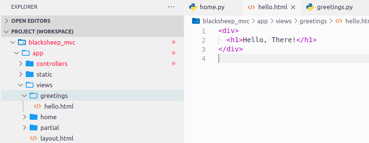
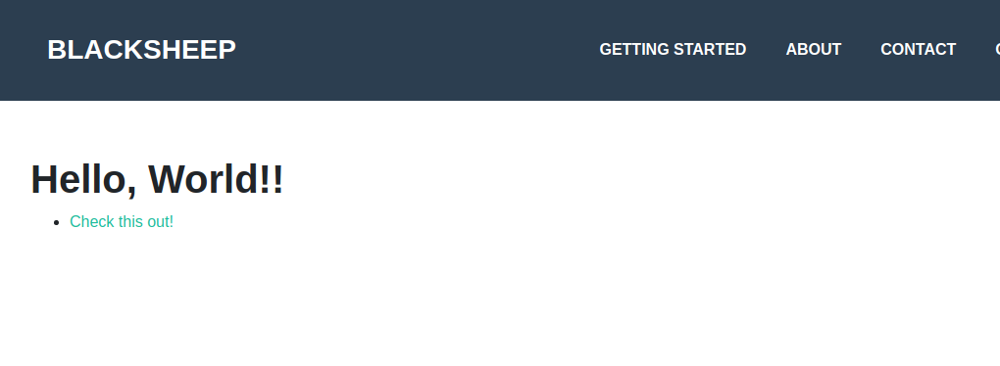

# Getting started with the MVC project template

This tutorial explains how to create a BlackSheep application using the
MVC ([_Model, View, Controller_](https://en.wikipedia.org/wiki/Model–view–controller))
project template, covering the following topics:

- [X] Creating an application from a project template, using the BlackSheep CLI.
- [X] Routes defined using classes (controllers).
- [X] Server side templating (views and models).
- [X] Handling parameters in controllers.
- [X] Serving static files

It is recommended to follow the [previous tutorial](getting-started.md) before
reading this one.

### Requirements

* [Python](https://www.python.org) version >= **3.10** (3.8 and 3.9 are
  supported but not recommended for this tutorial)
* Ensure the Python executable is included in the `$PATH` environment variable.
  (tip: if you install Python on Windows using the official installer, enable
  the checkbox to update your `$PATH` variable during the installation)
* a text editor: any is fine; this tutorial uses [Visual Studio Code](https://code.visualstudio.com/Download)

## Introduction to the BlackSheep CLI

The previous tutorial covered the basics of creating an application from
scratch. While that knowledge is important, starting every project from scratch is often unnecessary. BlackSheep provides a command-line interface
(CLI) to simplify the process of starting new projects. The CLI can be installed from the
[Python Package Index](https://pypi.org/project/blacksheep-cli/) using the
`blacksheep-cli` package:

```bash
pip install blacksheep-cli
```

The BlackSheep-CLI provides the `create` command to start new projects:

```bash
blacksheep create
```

The CLI will prompt for input about various options. For the sake of this
tutorial, answer:

- `tutorial` for project name
- `mvc` for the project template
- `Yes` for OpenAPI Documentation
- `essentials-configuration` to read settings
- `YAML` for app settings format

```
✨ Project name: tutorial
🚀 Project template: mvc
📜 Use OpenAPI Documentation? Yes
🔧 Library to read settings essentials-configuration
🔩 App settings format (Use arrow keys)
 » YAML
   TOML
   JSON
   INI
```

/// admonition | BlackSheep create.
    type: tip

It is possible to use the `create` command specifying the project name
and template directly, like in:

- `blacksheep create some_name`
- `blacksheep create some_name --template api`

///


After a project is created, the CLI displays a message with instructions:

```
──────────────────────────────────────────────────────────────────────
🏗️  Project created in tutorial
──────────────────────────────────────────────────────────────────────
-- What's next:
        cd tutorial
        pip install -r requirements.txt
        python dev.py
```

Install the project dependencies:

- `cd` into the project folder
- create a new [Python virtual environment](https://docs.python.org/3/library/venv.html) (recommended but optional)
- install its dependencies with `pip install -r requirements.txt`

## Starting the application

Start the application using one of the following commands:

```bash
# using the provided dev.py file (useful to debug)
python dev.py

# or using the uvicorn CLI
uvicorn app.main:app --port 44777 --lifespan on --reload
```

Navigate to the local page, opening a browser at [`http://localhost:44777`](http://localhost:44777)
(use the same port used in the previous command).

The browser should display this page:


The web application is configured to handle several tasks:

- Build and serve dynamic HTML pages.
- Serve static files (e.g., images, JavaScript, CSS files).
- Expose an API and provide OpenAPI documentation for it.
- Handle application settings and manage application start/stop events.

Let's explore these elements in order, but first, let's review the project's
structure.

## Project structure

The project follows the folder structure outlined below:

```
├── app
│   ├── (application files)
│   │
│   ├── controllers
│   │   └── (controller files, defining routes)
│   │
│   ├── docs
│   │   └── (files for OpenAPI Documentation)
│   │
│   ├── static
│   │   └── (static files served by the web app)
│   │
│   └── views
│       └── (HTML templates, views compiled by the web app)
│
├── domain
│   └── (domain classes, POCO)
│
├── (root folder, where the main file starting the whole app resides)
├── dev.py  (file that can be used to start a development server, useful for debugging)
└── settings.dev.yaml (settings used when the env variable APP_ENV == dev)
└── settings.yaml (base settings file)
```

- The `app` folder contains files that are specific to the web application,
  settings, a folder for `controllers` that define request handlers, folders
  for `static` files and one for `views` (HTML templates).
- Other packages at the root of the project, like `domain`, should be
  abstracted from the web server and potentially reusable in other kinds of
  applications.
- The root folder contains the `dev.py` file to start the application in
  development mode, and settings files with `.yaml` extension that are read
  when the application starts (since the YAML format was selected when using
  the `blacksheep create` command).

## Open the project with a text editor

Open the project's folder using your favorite text editor.


## Routes defined using classes (controllers)

The previous tutorial described how routes can be defined using functions:

```python
@get("/")
async def home():
    ...
```

BlackSheep offers an alternative way to define request handlers: using classes.
Both approaches have pros and cons, which will be described later in
more detail. To see this in practice, create a new file
`app/controllers/greetings.py` and copy the following code into it:

```python
from blacksheep.server.controllers import Controller, get


class Greetings(Controller):

    @get("/hello-world")
    def index(self):
        return self.text("Hello, World!")
```

Stop and restart the application, then navigate to
[`http://localhost:44777/hello-world`](http://localhost:44777/hello-world): it
will display the response from the `Greetings.index` method.

When the path of a web request matches a route defined in a controller, a new
instance of that `Controller` is created to handle the request. In other words,
each container instance is scoped to a specific web request. Just like function
handlers, controllers support automatic injection of parameters and dependency
injection to resolve parameters defined in constructors (`__init__` methods)
and class properties. This feature enhances development speed and promotes
cleaner code.

/// admonition | Rodi documentation.
    type: info

Refer to [Rodi's documentation](https://www.neoteroi.dev/rodi/) for a detailed
introduction to dependency injection.
///

The `Controller` class provides methods to return various kinds of responses
and offers `on_request` and `on_response` extensibility points. These functions
can be overridden in subclasses of `Controller` to apply logic at the start and
end of each web request.

/// admonition | Automatic import of controllers and routes.
    type: tip

Python modules defined inside `controllers` and `routes` packages are
automatically imported by a BlackSheep application. The automatic import
happens relatively to the namespace where the application is instantiated.
///

## Server side templating (views and models)

Server-side templating refers to a web application's ability to generate HTML
pages using templates and dynamic variables. By default, BlackSheep achieves
this with the [`Jinja2` library](https://palletsprojects.com/p/jinja/)
developed by the [Pallets](https://palletsprojects.com) team.

To see how this works in practice when using controllers, edit the `Greetings`
controller created previously as follows:

```python {hl_lines="8"}
from blacksheep.server.controllers import Controller, get


class Greetings(Controller):

    @get("/hello-view")
    def hello(self):
        return self.view()
```

Then, create a new folder inside `views` directory, named "greetings", and
add an HTML file named "hello.jinja".

<!--TODO: UPDATE THE PICTURE!-->



Copy the following contents into `hello.jinja`:

```html
<div>
  <h1>Hello, There</h1>
</div>
```

Now navigate to [http://localhost:44777/hello-view](http://localhost:44777/hello-view),
to see the response from the new HTML view.

Notice how convention over configuration is used in this case, to determine that
`./views/greetings/hello.jinja` file must be used, because of the convention:<br />
`./views/{CONTROLLER_NAME}/{METHOD_NAME}.jinja`.

The view currently is an HTML fragment, not a full document. To make it a
full page, modify `hello.jinja` to use the application layout:

```html {hl_lines="1 11-15"}


  Hello Page!


  Project template to create web applications with MVC architecture using BlackSheep web framework.


  <link rel="stylesheet" href="/styles/public.css" />


  <div style="margin: 10em 2em;">
    <h1>Hello, There!</h1>
  </div>




```

Refresh the page at [http://localhost:44777/hello-view](http://localhost:44777/hello-view) to see the result.

In this case, a page layout is applied using: ``,
with several blocks defined in `layout.jinja`. For more information on layouts
and features of the templating library, refer to the [Jinja2
documentation](https://jinja2docs.readthedocs.io/en/stable/).

---

Until now, the tutorial have only demonstrated the _Controller_ and _View_
components of the _MVC_ architecture. A _Model_ serves as the context for an
HTML view. To include dynamic content in an HTML template, use mustache-style
_`{{name}}`_ placeholders and pass a model with properties whose names match
the placeholders to the `view` function.

For example, modify `hello.jinja` to use dynamic content from a model:

```html {hl_lines="5-7"}
  <div style="margin: 10em 2em;">
    <h1>Hello, {{name}}!</h1>

    <ul>
      
        <li><a href="{{ sentence.url }}">{{ sentence.text }}</a></li>
      
    </ul>
  </div>
```

and `greetings.py` to contain the following code:

```python {hl_lines="13 22-23"}
from dataclasses import dataclass
from typing import List
from blacksheep.server.controllers import Controller, get


@dataclass
class Sentence:
    text: str
    url: str


@dataclass
class HelloModel:
    name: str
    sentences: List[Sentence]


class Greetings(Controller):

    @get("/hello-view")
    def hello(self):
        return self.view(
            model=HelloModel(
                "World!",
                sentences=[
                    Sentence(
                        "Check this out!",
                        "https://github.com/RobertoPrevato/BlackSheep",
                    )
                ],
            )
        )
```

Produces this result:


Models can be defined as [dictionaries](https://docs.python.org/3.9/library/stdtypes.html#dict),
[dataclasses](https://docs.python.org/3/library/dataclasses.html),
[pydantic models](https://pydantic-docs.helpmanual.io), or regular classes
implementing a constructor.

## Handling parameters in controllers

The _Getting started guide_ demonstrated how request handlers support the
automatic injection of parameters from HTTP requests. Controllers offer the
same functionality, allowing parameters to be automatically read and passed
into controller methods:

```python
class Example(Controller):

    @get("/example/{value}")
    def route_example(self, value: str):
        return self.text(f"Got: {value} in route")

    @get("/example")
    def query_example(self, value: str):
        return self.text(f"Got: {value} in query string")
```

Controllers also support dependency injection for their constructor
(`__init__` method) and class properties, this will be explained in the next
page.

## Serving static files

The homepage of the MVC project template looks like in the following picture:


The project template includes a folder for static files, such as images, CSS,
and JavaScript files. Static files are served using a catch-all route that
reads files whose paths, relative to the static folder, match the URL path of
the request.

For example, if the `static` folder contains the file `scripts/example.js`, an
HTTP GET web request to `http://localhost:44777/scripts/example.js` will
resolve to this file and its related information. When serving static files,
BlackSheep automatically handles several tasks:

- It manages the `ETag` response header, the `If-None-Match` request header, and
  `HTTP 304 Not Modified` responses when files remain unchanged on the file
  system.
- It processes `HTTP GET` and `HTTP HEAD` requests to return file information.
- It supports Range requests, enabling pause-and-resume downloads and optimal
  handling of videos (e.g., downloading videos from a specific point in time).

Add a file to the static folder and access it by entering its path in your
browser.

Relative paths are supported, but only files within the root static folder are
served. It is not possible to download files outside of the static folder, as
this would pose a security risk. Additionally, BlackSheep only handles certain
file extensions by default, specifically the most common ones used in web
applications. Paths starting with '/' are always treated as absolute paths
starting from the root of the website.

## Strategy for application settings

The `API` and the `MVC` project templates include a strategy to read and
validate application settings from various sources and support multiple
system environments (like `dev`, `test`, and `prod` environments).

- [`Pydantic`](https://docs.pydantic.dev/latest/) is always used to describe and validate application settings.
- Application settings can be read from various sources using either
  `Pydantic v1 BaseSettings` class, or `essentials-configuration`.
- When using `essentials-configuration`, use the `APP_ENV` environment variable
  to control the application environment and to use environment-specific
  settings from dedicated files using the pattern:
  `settings.{{env_name}}.{{format}}`, like `settings.test.yaml`,
  `settings.prod.toml`.

For more information on application settings and the recommended way to apply
configuration depending on the application environment, refer to [_Settings_](/blacksheep/settings/).

## Summary

This tutorial covered some higher-level topics of a BlackSheep application. The
general concepts presented here apply to many kinds of web frameworks:

- server side templating of HTML views
- serving of static files
- use of MVC architecture

The next pages describe the built-in support for
[dependency injection](dependency-injection.md), and automatic generation of
[OpenAPI Documentation](openapi.md).


/// admonition | For more information...

For more information about Server Side Rendering, read [_Templating_](/blacksheep/templating/).

For more information about the BlackSheep CLI, read [_More about the CLI_](/blacksheep/cli/).

///

/// admonition | Don't miss the api project template.
    type: tip

Try also the `api` project template, to start new Web API projects that
don't handle HTML views.

///
