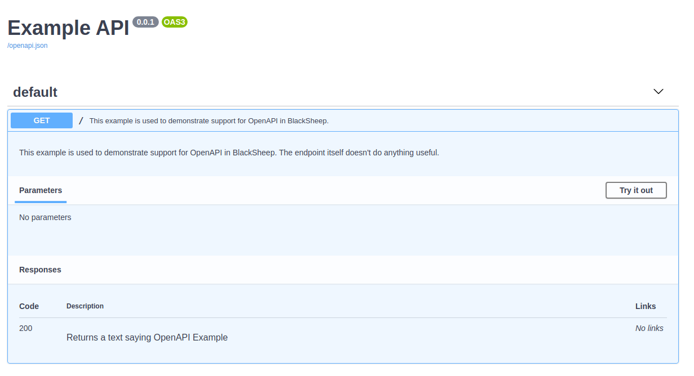

# OpenAPI Documentation

BlackSheep implements automatic generation of OpenAPI Documentation for most
common **REST API** scenarios, and provides methods to fully control the
OpenAPI Specification file. This page describes the following:

- [X] An introduction to OpenAPI Documentation.
- [X] Built-in support for OpenAPI Documentation.
- [X] How to document endpoints.
- [X] How to handle common responses.
- [X] Expose the documentation for anonymous access.
- [X] Options to display OpenAPI Documentation.
- [X] How to implement a custom `UIProvider`.
- [X] How to document authentication schemes.
- [X] How to specify OpenAPI tags for Controller classes.

## Introduction to OpenAPI Documentation

Citing from the [Swagger website](https://swagger.io/specification/), at the
time of this writing:

> The OpenAPI Specification (OAS) defines a standard {...}
> interface to RESTful APIs which allows both humans and computers to discover
> and understand the capabilities of the service {...}.
>
> An OpenAPI definition can then be used by documentation generation tools to
> display the API, code generation tools to generate servers and clients in
> various programming languages, testing tools, and many other use cases.

Since a web application inherently knows the paths it handles and a certain
amount of metadata can be inferred from the source code, BlackSheep provides
automatic generation of OpenAPI documentation. It also offers an API to enhance
the documentation with additional information that cannot be inferred from the
source code.

If you followed the [Getting started: MVC](mvc-project-template.md) tutorial,
the project template is preconfigured to include an example of OpenAPI
documentation and to expose a Swagger UI at the `/docs` path.


## Built-in support for OpenAPI Documentation

The following piece of code describes a minimal set-up to enable generation of
OpenAPI Documentation and exposing a Swagger UI in BlackSheep:

```python {hl_lines="9-10"}
from dataclasses import dataclass

from blacksheep import Application, get
from blacksheep.server.openapi.v3 import OpenAPIHandler
from openapidocs.v3 import Info

app = Application()

docs = OpenAPIHandler(info=Info(title="Example API", version="0.0.1"))
docs.bind_app(app)


@dataclass
class Foo:
    foo: str


@get("/foo")
async def get_foo() -> Foo:
    return Foo("Hello!")
```

If you start this application and navigate to its `/docs` route, you will see
a Swagger UI like this:


---

In this example, BlackSheep generates the following specification and offers
it in both **JSON** and **YAML** format:

=== "/openapi.yaml"

    ```yaml
    openapi: 3.1.0
    info:
        title: Example API
        version: 0.0.1
    paths:
        /foo:
            get:
                responses:
                    '200':
                        description: Success response
                        content:
                            application/json:
                                schema:
                                    $ref: '#/components/schemas/Foo'
                operationId: get_foo
    servers: []
    components:
        schemas:
            Foo:
                type: object
                required:
                - foo
                properties:
                    foo:
                        type: string
                        nullable: false
    tags: []
    ```

=== "/openapi.json"

    ```json
    {
        "openapi": "3.1.0",
        "info": {
            "title": "Example API",
            "version": "0.0.1"
        },
        "paths": {
            "/foo": {
                "get": {
                    "responses": {
                        "200": {
                            "description": "Success response",
                            "content": {
                                "application/json": {
                                    "schema": {
                                        "$ref": "#/components/schemas/Foo"
                                    }
                                }
                            }
                        }
                    },
                    "operationId": "get_foo"
                }
            }
        },
        "servers": [],
        "components": {
            "schemas": {
                "Foo": {
                    "type": "object",
                    "required": [
                        "foo"
                    ],
                    "properties": {
                        "foo": {
                            "type": "string",
                            "nullable": false
                        }
                    }
                }
            }
        },
        "tags": []
    }
    ```

### Supported types

The framework provides built-in support for the following types:

- Built-in `dataclasses`.
- [Pydantic v2 `BaseModel`](https://docs.pydantic.dev/latest/).
- [Pydantic v2 `dataclasses`](https://docs.pydantic.dev/latest/concepts/dataclasses/) (since version `2.2.0`).
- [Pydantic v1 `BaseModel`](https://docs.pydantic.dev/1.10/).

/// admonition | Pydantic is fully supported since version 2.2.0.
    type: tip

Support for Pydantic has been improved in `2.2.0`, now the framework uses the
OpenAPI Specification generated by Pydantic when handling `BaseModel` and
Pydantic `dataclasses`. It is recommended to upgrade to version `2.2.0`.

///

To support more types, define types implementing the `ObjectTypeHandler`
interface and add it to the list of object_types_handlers:

```python
from blacksheep.server.openapi.v3 import OpenAPIHandler, ObjectTypeHandler


class CustomTypeHandler(ObjectTypeHandler):
    # TODO: implement the interface


docs.object_types_handlers.append(CustomTypeHandler())
```

---

To provide more details for api routes, decorate request handlers using the
instance of `OpenAPIHandler` as a decorator:

```python

@docs(responses={200: "Returns a text saying OpenAPI Example"})
@get("/")
def home():
    return "OpenAPI Example"
```

After this change, the specification file includes the new information:

```yaml
openapi: 3.1.0
info:
    title: Example API
    version: 0.0.1
paths:
    /foo:
        get:
            responses:
                '200':
                    description: Returns a text saying OpenAPI Example
            operationId: get_foo
servers: []
components: {}
tags: []
```

### Request body binders support

/// admonition | Enhanced in BlackSheep 2.6.0
    type: info

BlackSheep 2.6.0 adds full OpenAPI documentation support for `FromText` and `FromFiles` binders. These binders are now automatically documented with appropriate request body schemas and content types.

///

BlackSheep automatically generates OpenAPI documentation for various request body binders:

#### FromJSON

Documented with `application/json` content type and the appropriate schema:

```python
from dataclasses import dataclass
from blacksheep import FromJSON, post


@dataclass
class CreateUserInput:
    name: str
    email: str
    age: int


@docs(
    summary="Create a new user",
    responses={201: "User created successfully"}
)
@post("/api/users")
async def create_user(input: FromJSON[CreateUserInput]):
    return {"user_id": 123}
```

The OpenAPI documentation automatically includes the request body schema for `CreateUserInput`.

#### FromFiles (since 2.6.0)

Documented with `multipart/form-data` content type:

```python
from blacksheep import FromFiles, post


@docs(
    summary="Upload files",
    responses={201: "Files uploaded successfully"}
)
@post("/api/upload")
async def upload_files(files: FromFiles):
    return {"files_count": len(files.value)}
```

The OpenAPI documentation automatically documents this as a file upload endpoint with `multipart/form-data` encoding.

#### FromText (since 2.6.0)

Documented with `text/plain` content type:

```python
from blacksheep import FromText, post


@docs(
    summary="Store text content",
    responses={201: "Text stored successfully"}
)
@post("/api/text")
async def store_text(content: FromText):
    return {"length": len(content.value)}
```

#### Mixed multipart/form-data (since 2.6.0)

When combining `FromText` and `FromFiles` in the same endpoint, BlackSheep generates appropriate `multipart/form-data` documentation:

```python
from blacksheep import FromFiles, FromText, post


@docs(
    summary="Upload files with description",
    responses={201: "Upload completed successfully"}
)
@post("/api/upload-with-metadata")
async def upload_with_metadata(
    description: FromText,
    files: FromFiles,
):
    return {
        "description": description.value,
        "files_count": len(files.value)
    }
```

The OpenAPI specification will correctly document both the text field and file upload field as part of the `multipart/form-data` request body.

#### FromForm

Documented with `application/x-www-form-urlencoded` or `multipart/form-data` content type:

```python
from dataclasses import dataclass
from blacksheep import FromForm, post


@dataclass
class ContactForm:
    name: str
    email: str
    message: str


@docs(
    summary="Submit contact form",
    responses={200: "Form submitted successfully"}
)
@post("/api/contact")
async def submit_contact(form: FromForm[ContactForm]):
    return {"status": "received"}
```

### Adding description and summary

An endpoint description can be specified either using a `docstring`:

```python
@docs(responses={200: "Returns a text saying OpenAPI Example"})
@get("/")
async def home():
    """
    This example is used to demonstrate support for OpenAPI in BlackSheep.
    The endpoint itself doesn't do anything useful.
    """
    return "OpenAPI Example"
```

Or in the `@docs` decorator:

```python
@docs(
    summary="This example is used to demonstrate support for OpenAPI in BlackSheep.",
    description="The endpoint itself doesn't do anything useful.",
    responses={200: "Returns a text saying OpenAPI Example"},
)
@get("/")
async def home():
    return "OpenAPI Example"
```

When using `docstring`, the first line of the docstring is used as the summary,
and the whole docstring as the description.



Most of the BlackSheep code base is typed using the `typing` module, thus IDEs
and text editors like Visual Studio Code and PyCharm can provide user's
friendly hints for code completion (see the screenshot below). 

### Ignoring endpoints

To exclude certain endpoints from the API documentation, use `@docs.ignore()`:

```python
@docs.ignore()
@get("/hidden-from-docs")
async def hidden_endpoint():
    return "This endpoint won't appear in documentation"
```

### Specifying OpenAPI tags for Controllers

Before BlackSheep 2.4.4, OpenAPI tags were automatically generated based on the controller class name. For example, a `Pets(Controller)` class would automatically generate a "Pets" tag for all its endpoints. The new `@docs.tags()` decorator provides explicit control over tag assignment and supports multiple tags per controller.

Starting from BlackSheep 2.4.4, you can specify OpenAPI tags directly on Controller classes to organize and categorize your API endpoints in the documentation.

You can specify OpenAPI tags for Controller classes using the `@docs.tags()` decorator. This allows you to organize your API endpoints into logical groups in the generated OpenAPI documentation:

```python
from blacksheep import Application
from blacksheep.server.controllers import Controller, get, post, put, delete
from blacksheep.server.openapi.v3 import OpenAPIHandler
from openapidocs.v3 import Info
from dataclasses import dataclass
from uuid import UUID

app = Application()

docs = OpenAPIHandler(info=Info(title="Pet Store API", version="1.0.0"))
docs.bind_app(app)


@dataclass
class Pet:
    id: UUID
    name: str
    category: str


@dataclass
class CreatePetInput:
    name: str
    category: str


@docs.tags("Pets")
class PetsController(Controller):
    """
    Controller for managing pets in the store.
    """

    @classmethod
    def route(cls) -> str:
        return "/api/pets"

    @get()
    async def get_pets(self) -> list[Pet]:
        """Get all pets"""
        return []

    @get("/{pet_id}")
    async def get_pet(self, pet_id: UUID) -> Pet:
        """Get a pet by ID"""
        pass

    @post()
    async def create_pet(self, input: CreatePetInput) -> Pet:
        """Create a new pet"""
        pass

    @put("/{pet_id}")
    async def update_pet(self, pet_id: UUID, input: CreatePetInput) -> Pet:
        """Update an existing pet"""
        pass

    @delete("/{pet_id}")
    async def delete_pet(self, pet_id: UUID) -> None:
        """Delete a pet"""
        pass


@docs.tags("Orders", "Store")
class OrdersController(Controller):
    """
    Controller for managing store orders.
    """

    @classmethod
    def route(cls) -> str:
        return "/api/orders"

    @get()
    async def get_orders(self) -> list[dict]:
        """Get all orders"""
        return []

    @post()
    async def create_order(self, order_data: dict) -> dict:
        """Create a new order"""
        return {}
```

In this example:

- All endpoints in `PetsController` will be tagged with **"Pets"**
- All endpoints in `OrdersController` will be tagged with both **"Orders"** and **"Store"**
- The tags help organize the API documentation into logical sections

### Multiple tags per Controller

You can specify multiple tags for a single Controller by passing multiple string arguments:

```python
@docs.tags("Users", "Authentication", "Admin")
class UserManagementController(Controller):
    @classmethod
    def route(cls) -> str:
        return "/api/admin/users"

    @get()
    async def list_users(self):
        """List all users (Admin only)"""
        return []
```

### Benefits of Controller tags

1. **Better organization**: Group related endpoints together in the OpenAPI UI
2. **Improved navigation**: Users can easily find endpoints by category
3. **Cleaner documentation**: Logical grouping makes the API easier to understand
4. **Consistent tagging**: All endpoints in a Controller automatically inherit the same tags
5. **Multiple categorization**: Controllers can belong to multiple logical groups

### Tag display in OpenAPI UI

When you specify tags on Controllers, they appear in the OpenAPI documentation UI (Swagger, ReDoc, Scalar) as collapsible sections. Users can:

- Expand/collapse tag sections to focus on specific functionality
- Filter endpoints by tags (depending on the UI provider)
- See a hierarchical organization of your API surface

The tags are displayed in alphabetical order by default, making it easy for API consumers to navigate your documentation.

### Response annotation

Since version `2.4.4`, `Annotated` is supported to have proper automatic documentation
of response objects. Example:

```python {linenums="1" hl_lines="21"}
from typing import Annotated

from openapidocs.v3 import Info
from pydantic import BaseModel

from blacksheep import Application, get, json
from blacksheep.messages import Response
from blacksheep.server.openapi.v3 import OpenAPIHandler

app = Application()

docs = OpenAPIHandler(info=Info(title="Example API", version="0.0.1"))
docs.bind_app(app)


class Example(BaseModel):
    foo: str


@get("/foo")
async def get_foo() -> Annotated[Response, Example]:
    response = json(Example(foo="Hello!"))
    response.add_header(b"X-Foo", b"Foo")
    return response
```

Produces the following documentation:

```yaml {linenums="1" hl_lines="11-14 17-19"}
openapi: 3.1.0
info:
    title: Example API
    version: 0.0.1
paths:
    /foo:
        get:
            responses:
                '200':
                    description: Success response
                    content:
                        application/json:
                            schema:
                                $ref: '#/components/schemas/Example'
            operationId: get_foo
servers: []
components:
    schemas:
        Example:
            properties:
                foo:
                    title: Foo
                    type: string
            required:
            - foo
            title: Example
            type: object
tags: []
```

### Documenting only certain routes

To document only certain routes, use an include function like in the example
below. For example, to include only those routes that contain "/api":

```python
# include only endpoints whose path contains "/api/"
docs.include = lambda path, _: "/api/" in path
```

### Documenting response examples

The following example shows how to describe examples for responses:

```python
from dataclasses import dataclass
from datetime import datetime
from uuid import UUID

from blacksheep import Application, get, json
from blacksheep.server.openapi.common import ContentInfo, ResponseExample, ResponseInfo
from blacksheep.server.openapi.v3 import OpenAPIHandler
from openapidocs.v3 import Info

app = Application()

docs = OpenAPIHandler(info=Info(title="Example API", version="0.0.1"))
docs.bind_app(app)


@dataclass
class Cat:
    id: UUID

    name: str
    creation_time: datetime


@docs(
    summary="Gets a cat by id",
    description="""A sample API that uses a pet store as an
          example to demonstrate features in the OpenAPI 3 specification""",
    responses={
        200: ResponseInfo(
            "A cat",
            content=[
                ContentInfo(
                    Cat,
                    examples=[
                        ResponseExample(
                            Cat(
                                id=UUID("3fa85f64-5717-4562-b3fc-2c963f66afa6"),
                                name="Foo",
                                creation_time=datetime.now(),
                            )
                        )
                    ],
                )
            ],
        ),
        404: "Cat not found",
    },
)
@get("/api/cats/{cat_id}")
def get_cat_by_id(cat_id: UUID):
    ...
```

If the code seems excessively verbose, consider that OpenAPI specification is
designed to support documenting responses with different content types (e.g.
JSON, XML, etc.) and having examples for each content type. Writing the
documentation by hand would be much more time consuming!

BlackSheep automatically generates component schemas by type (in this example,
`Cat`) and reuses them in all API endpoints that use them:


/// details | Reusable components schemas.

```yaml {linenums="1" hl_lines="14 31-33"}
openapi: 3.1.0
info:
    title: Example API
    version: 0.0.1
paths:
    /api/cats/{cat_id}:
        get:
            responses:
                '200':
                    description: A cat
                    content:
                        application/json:
                            schema:
                                $ref: '#/components/schemas/Cat'
                '404':
                    description: Cat not found
            summary: Gets a cat by id
            description: "A sample API that uses a pet store as an\n          example\
                \ to demonstrate features in the OpenAPI 3 specification"
            operationId: get_cat_by_id
            parameters:
            -   name: cat_id
                in: path
                schema:
                    type: string
                    format: uuid
                    nullable: false
                description: ''
                required: true
servers: []
components:
    schemas:
        Cat:
            type: object
            required:
            - id
            - name
            - creation_time
            properties:
                id:
                    type: string
                    format: uuid
                    nullable: false
                name:
                    type: string
                    nullable: false
                creation_time:
                    type: string
                    format: date-time
                    nullable: false
tags: []
```

///

### Avoid code pollution using EndpointDocs

If you are familiar with other libraries that produce OpenAPI Documentation and
you consider the example above, you might notice that adding OpenAPI details to
request handlers can pollute the source code and distract the programmer from
the actual request handlers' logic.

BlackSheep provides a way to avoid polluting the source code and keep the code
for OpenAPI in dedicated files. Use the `blacksheep.server.openapi.common.EndpointDocs`
class to define documentation in dedicated files and keep your request handlers
code clean:

```python
from apidocs.cats import get_cat_docs

@docs(get_cat_docs)
@get("/api/cats/{cat_id}")
def get_cat_by_id(cat_id: UUID):
    ...
```

To see a complete example, refer to the source code of the [MVC project
template](https://github.com/Neoteroi/BlackSheep-MVC), and see how
documentation is organized and configured (in `app.docs`, `app.controllers.docs`).

### Deprecating an API

To mark an endpoint as deprecated, use `@docs.deprecated()`:

```python
@docs.deprecated()
@get("/some-deprecated-api")
async def deprecated_endpoint():
    return "This endpoint is deprecated"
```

### Altering the specification upon creation

To alter the specification file upon creation, define a subclass of
`OpenAPIHandler` that overrides `on_docs_generated` method.

```python
from blacksheep import Application, json
from blacksheep.server.openapi.v3 import OpenAPIHandler
from openapidocs.v3 import Info, OpenAPI, Server

app = Application()


class MyOpenAPIHandler(OpenAPIHandler):
    def on_docs_generated(self, docs: OpenAPI) -> None:
        docs.servers = [
            Server(url="https://foo-example.org"),
            Server(url="https://test.foo-example.org"),
        ]


docs = MyOpenAPIHandler(info=Info(title="Example API", version="0.0.1"))
docs.bind_app(app)
```

To fully control the specification upon its creation as Python `dict`,
either override the `build_docs` method of your custom-defined `OpenAPIHandler`,
or specify a custom `Serializer` like in the example below (this second option
is only available since version `2.2.0`).

```python
from openapidocs.common import Serializer


class CustomSerializer(Serializer):
    def to_obj(self, item: Any) -> Any:
        obj = super().to_obj(item)
        # Fully control for the specification dictionary here
        return obj


docs = OpenAPIHandler(
    info=Info(title="Example API", version="0.0.1"), serializer=CustomSerializer()
)
```

### Handling common responses

APIs often implement a common way to handle failures, to provide clients with
details for web requests that cannot be completed successfully. For example, an
API might return a response body like the following, in case of a bad request
for a certain endpoint:

```json
{
    "error": "The provided country code is not supported",
    "code": "InvalidCountryCode"
}
```

Such response body can be handled using a `dataclass` or Pydantic model:

```python
from dataclasses import dataclass


@dataclass
class ErrorInfo:
    error: str
    code: int
```

Common responses can be documented this way:

```python {linenums="1" hl_lines="4 12 23"}
from openapidocs.v3 import MediaType, Response as ResponseDoc, Schema


error_info = docs.register_schema_for_type(ErrorInfo)

docs.common_responses = {
    400: ResponseDoc(
        "Bad request",
        content={
            "application/json": MediaType(
                schema=Schema(
                    any_of=[error_info],
                    example=ErrorInfo(error="Invalid argument", code=1001),
                )
            )
        },
    ),
    401: ResponseDoc(
        "Unauthorized",
        content={
            "application/json": MediaType(
                schema=Schema(
                    any_of=[error_info],
                    example=ErrorInfo(error="The user is not authorized", code=3),
                )
            )
        },
    ),
}
```

### Support for generics

The generation of OpenAPI Documentation supports [generic
types](https://docs.python.org/3/library/typing.html#typing.Generic). Consider
the following example:

1. A common use case is implementing an API that returns a paginated subset of
   elements, often based on filters (e.g., textual search).
1. Clients need to know the total count of items matching the filters to
   display the total number of items and calculate the number of pages required
   to show all results (depending on the page size).
1. In such scenarios, using a `Generic` type is an effective solution, as many
   kinds of objects can be paginated.

_Example of generic class definition_

```python
from dataclasses import dataclass
from typing import List, Generic, TypeVar


T = TypeVar("T")


@dataclass
class PaginatedSet(Generic[T]):
    items: List[T]
    total: int
```

_Full example illustrating OpenAPI Documentation for generics:_

```python {linenums="1" hl_lines="11 14-17 36 40"}
from dataclasses import dataclass
from datetime import datetime
from typing import Generic, List, TypeVar
from uuid import UUID

from openapidocs.v3 import Info

from blacksheep import Application, FromQuery
from blacksheep.server.openapi.v3 import OpenAPIHandler

T = TypeVar("T")


@dataclass
class PaginatedSet(Generic[T]):
    items: List[T]
    total: int


@dataclass
class Order:
    id: UUID
    customer_id: UUID
    creation_time: datetime


app = Application()


# enable OpenAPI Documentation
docs.bind_app(app)


@router.get("/api/orders")
async def get_orders(
    page: FromQuery[int] = FromQuery(1),
    page_size: FromQuery[int] = FromQuery(30),
    search: FromQuery[str] = FromQuery(""),
) -> PaginatedSet[Order]:
    """
    Returns a paginated set of orders.
    """

```

In the example below, the generic type is handled properly and produces the
following OpenAPI Documentation:

```yaml {linenums="1" hl_lines="9 11-14 40-41 61 71"}
openapi: 3.1.0
    title: Example

version: 0.0.1
paths:
    /api/orders:
        get:
            responses:
                '200':
                    description: Success response
                    content:
                        application/json:
                            schema:
                                $ref: '#/components/schemas/PaginatedSetOfOrder'
            operationId: get_orders
            summary: Returns a paginated set of orders.
            description: Returns a paginated set of orders.
            parameters:
            -   name: page
                in: query
                schema:
                    type: integer
                    format: int64
                    nullable: false
                description: ''
            -   name: page_size
                in: query
                schema:
                    type: integer
                    format: int64
                    nullable: false
                description: ''
            -   name: search
                in: query
                schema:
                    type: string
                    nullable: false
                description: ''
servers: []
components:
    schemas:
        Order:
            type: object
            required:
            - id
            - customer_id
            - creation_time
            properties:
                id:
                    type: string
                    format: uuid
                    nullable: false
                customer_id:
                    type: string
                    format: uuid
                    nullable: false
                creation_time:
                    type: string
                    format: date-time
                    nullable: false
        PaginatedSetOfOrder:
            type: object
            required:
            - items
            - total
            properties:
                items:
                    type: array
                    nullable: false
                    items:
                        $ref: '#/components/schemas/Order'
                total:
                    type: integer
                    format: int64
                    nullable: false
```

/// details | Generic types names.
    type: info

Generic types, expressed in Python using `GenericType[T]`, are
represented with `GenericTypeOfT` to respect OpenAPI specification, saying
that `$ref values must be RFC3986-compliant percent-encoded URIs`.
A generic type with more arguments, like `Foo[T, U, X]` gets represented with
`FooOfTAndUAndX`.

/// admonition | Alternative naming style in BlackSheep 2.4.4
    type: info

Starting from BlackSheep 2.4.4, you can enable alternative programming-style naming for generic types using underscore notation. Set the environment variable `APP_OPENAPI_PROGRAMMING_NAMES` to `'1'` or `'true'` to use names like `GenericType_T` instead of `GenericTypeOfT`.

///

///

### Describing parameters

It is possible to describe parameters explicitly using docstrings.

#### Documenting parameters explicitly

To document parameters explicitly, use the `@docs` like in the following
example (elaborating on the previous example about generics):

```python
@router.get("/api/orders")
@docs(
    parameters={
        "page": ParameterInfo(description="Page number"),
        "page_size": ParameterInfo(
            description="The number of items to display per page"
        ),
        "search": ParameterInfo(description="Optional text search"),
    },
)
async def get_orders(
    page: FromQuery[int] = FromQuery(1),
    page_size: FromQuery[int] = FromQuery(30),
    search: FromQuery[str] = FromQuery(""),
) -> PaginatedSet[Order]:
    """
    Returns a paginated set of orders.
    """
```

#### Documenting parameters using docstrings

BlackSheep supports documenting parameters using docstrings, and the following
styles are supported: Epytext, ReStructuredText, NumpyDoc.
The following sections show the previous example re-written to use docstrings.

=== "Epytext"

    ```python

    @router.get("/api/orders")
    async def get_orders(
        page: FromQuery[int] = FromQuery(1),
        page_size: FromQuery[int] = FromQuery(30),
        search: FromQuery[str] = FromQuery(""),
    ) -> PaginatedSet[Order]:
        """
        Returns a paginated set of orders.

        @param page: Page number
        @param page_size: The number of items to display per page
        @param search: Optional text search
        """

    ```

=== "ReStructuredText"

    ```python

    @router.get("/api/orders")
    async def get_orders(
        page: FromQuery[int] = FromQuery(1),
        page_size: FromQuery[int] = FromQuery(30),
        search: FromQuery[str] = FromQuery(""),
    ) -> PaginatedSet[Order]:
        """
        Returns a paginated set of orders.

        :param page: Page number
        :param page_size: The number of items to display per page
        :param search: Optional text search
        """
    ```

=== "NumpyDoc"

    ```python

    @router.get("/api/orders")
    async def get_orders(
        page: FromQuery[int] = FromQuery(1),
        page_size: FromQuery[int] = FromQuery(30),
        search: FromQuery[str] = FromQuery(""),
    ) -> PaginatedSet[Order]:
        """
        Returns a paginated set of orders.

        Parameters
        ----------
        page : Page number
        page_size : The number of items to display per page
        search : Optional text search
        """
    ```

The logic that parses docstrings can also extract types information, but this
is not documented because the recommended way is to use type annotations.
Refer to the file `test_openapi_docstrings.py` for more examples on the
information that can be extracted from docstrings.

### Anonymous access

If the server uses a default authorization policy that requires an
authenticated user, it is still possible to make the OpenAPI Documentation
endpoint available for anonymous access, using the `anonymous_access`
parameter:

```python
from blacksheep.server.openapi.v3 import OpenAPIHandler
from openapidocs.v3 import Info

docs = OpenAPIHandler(
    info=Info(title="Example API", version="0.0.1"), anonymous_access=True
)
```

### Support for ReDoc UI and Scalar UI

BlackSheep includes built-in support for three systems to display OpenAPI
documentation:

- [Swagger UI](https://swagger.io/tools/swagger-ui/) (default)
- [ReDoc UI](https://github.com/Redocly/redoc)
- [Scalar UI](https://github.com/scalar/scalar) (since version `2.2.0`)

To enable different ways to display OpenAPI Documentation, use the
`OpenAPIHandler.ui_providers` property.

=== "ReDoc UI"

    ```python
    from blacksheep.server.openapi.v3 import OpenAPIHandler
    from blacksheep.server.openapi.ui import ReDocUIProvider
    from openapidocs.v3 import Info

    docs = OpenAPIHandler(info=Info(title="Example API", version="0.0.1"))

    docs.ui_providers.append(ReDocUIProvider())
    ```

=== "Scalar UI"

    ```python
    from blacksheep.server.openapi.v3 import OpenAPIHandler
    from blacksheep.server.openapi.ui import ScalarUIProvider
    from openapidocs.v3 import Info

    docs = OpenAPIHandler(info=Info(title="Example API", version="0.0.1"))

    docs.ui_providers.append(ScalarUIProvider())
    ```

### How to implement a custom UIProvider

The BlackSheep package includes some static files to offer a good user
experience in some circumstances. These include HTML pages used when enabling
Swagger UI or ReDoc UI.

To control those pages, for example, to alter the HTML structure or use
different sources for JavaScript and CSS files (which by the way could be the
BlackSheep application serving the OpenAPI specification files), it is
recommended to:

- define a custom implementation of `UIProvider`
- maintain the desired HTML file

Example:

```python
from dataclasses import dataclass
from pathlib import Path

from blacksheep import Application
from blacksheep.server.openapi.v3 import OpenAPIHandler
from blacksheep.server.openapi.ui import SwaggerUIProvider, UIOptions
from openapidocs.v3 import Info

app = Application()


class CustomUIProvider(SwaggerUIProvider):
    def get_openapi_ui_html(self, options: UIOptions) -> str:
        _template = Path("example.html").read_text()
        return _template.replace("{options.spec_url}", options.spec_url)


# Set the UI provider as desired:

docs.ui_providers = [CustomUIProvider()]
docs.bind_app(app)


@dataclass

class Foo:
    foo: str


@route("/foo")
async def get_foo() -> Foo:
    return Foo("Hello!")
```

_example.html_:

```html
<!DOCTYPE html>
<html>
<head>
    <title>My desired title</title>
    <link rel="icon" href="/favicon.png"/>
    <link type="text/css" rel="stylesheet" href="https://cdnjs.cloudflare.com/ajax/libs/swagger-ui/5.10.0/swagger-ui.css">
</head>
<body>
    <div id="swagger-ui"></div>
    <script src="https://cdnjs.cloudflare.com/ajax/libs/swagger-ui/5.10.0/swagger-ui-bundle.min.js"></script>
    <script>
    const ui = SwaggerUIBundle({
        url: '{options.spec_url}',
        oauth2RedirectUrl: window.location.origin + '/docs/oauth2-redirect',
        dom_id: '#swagger-ui',
        presets: [
            SwaggerUIBundle.presets.apis,
            SwaggerUIBundle.SwaggerUIStandalonePreset
        ],
        layout: "BaseLayout",
        deepLinking: true,
        showExtensions: true,
        showCommonExtensions: true
    })
    </script>
</body>
</html>
```

### Changing operations ids

When OpenAPI Documentation is generated, operation ids are obtained from the
name of the Python function definitions.

For example, having a `get_foo` request handler generates an object having
`operationId` equal to "get_foo":

```python
@router.get("/foo")
async def get_foo() -> Foo:
    return Foo("Hello!")
```

```json
    "paths": {
        "/foo": {
            "get": {
                …,
                "operationId": "get_foo"
            }
        }
    },
```

To change how `operationId` is generated for endpoints, define a custom type
of `OpenAPIHandler` that overrides the `get_operation_id` method, to produce
the desired result:

```python
class CustomOpenAPIHandler(OpenAPIHandler):
    def get_operation_id(self, docs: EndpointDocs | None, handler) -> str:
        return handler.__name__.capitalize().replace("_", " ")
```

## Documenting authentication

Since version `2.4.2`, BlackSheep automatically generates OpenAPI Documentation for
authentication handlers when using the built-in [authentication classes](./authentication.md).
This means that when you configure API Key, Basic, or JWT Bearer, the
corresponding security schemes are automatically added to your OpenAPI
specification.

### Automatic documentation for built-in handlers

The following built-in authentication handlers are automatically documented:

- **APIKeyAuthentication** → generates `ApiKey` security scheme.
- **BasicAuthentication** → generates `HTTP Basic` security scheme.
- **JWTBearerAuthentication** → generates `HTTP Bearer` security scheme with JWT format.

```python
from blacksheep import Application
from blacksheep.server.authentication.apikey import APIKey, APIKeyAuthentication
from blacksheep.server.authentication.basic import BasicAuthentication, BasicCredentials
from blacksheep.server.authentication.jwt import JWTBearerAuthentication
from blacksheep.server.openapi.v3 import OpenAPIHandler
from openapidocs.v3 import Info
from essentials.secrets import Secret

app = Application()

# Configure OpenAPI documentation
docs = OpenAPIHandler(info=Info(title="My API", version="1.0.0"))
docs.bind_app(app)

# These authentication handlers will be automatically documented
app.use_authentication().add(
    APIKeyAuthentication(
        APIKey(secret=Secret("$API_SECRET")),
        param_name="X-API-Key",
        description="API key for authentication"  # ⟵ appears in OpenAPI docs
    )
).add(
    BasicAuthentication(
        BasicCredentials(
            username="admin",
            password=Secret("$ADMIN_PASSWORD")
        ),
        description="Basic authentication for admin users"  # ⟵ appears in OpenAPI docs
    )
).add(
    JWTBearerAuthentication(
        authority="https://your-authority.com",
        valid_audiences=["your-audience"]
        # Automatically documented as Bearer JWT
    )
)
```

The generated OpenAPI specification will include:

```yaml
components:
  securitySchemes:
    ApiKey:
      type: apiKey
      name: X-API-Key
      in: header
      description: API key for authentication
    Basic:
      type: http
      scheme: basic
      description: Basic authentication for admin users
    Bearer:
      type: http
      scheme: bearer
      bearerFormat: JWT
security:
  - ApiKey: []
  - Basic: []
  - JWTBearerAuthentication: []
```

### Custom SecuritySchemeHandler

To control how your custom authentication handlers are documented, implement the
`SecuritySchemeHandler` abstract class:

```python
from typing import Iterable, Tuple
from blacksheep import Application
from blacksheep.server.openapi.v3 import OpenAPIHandler, SecuritySchemeHandler
from blacksheep.server.authentication import AuthenticationHandler
from guardpost import AuthenticationHandler, Identity
from openapidocs.v3 import Info, SecurityScheme, HTTPSecurity, SecurityRequirement

# Custom authentication handler
class CustomTokenAuthentication(AuthenticationHandler):
    def __init__(self, scheme: str = "CustomToken"):
        self.scheme = scheme
        self.description = "Custom token authentication"

    async def authenticate(self, context) -> Identity | None:
        # Your custom authentication logic here
        token = context.get_first_header(b"X-Custom-Token")
        if token:
            # Validate token and return identity
            return Identity({"sub": "user123"}, self.scheme)
        return None


# Custom security scheme handler
class CustomTokenSecuritySchemeHandler(SecuritySchemeHandler):
    def get_security_schemes(
        self, handler: AuthenticationHandler
    ) -> Iterable[Tuple[str, SecurityScheme, SecurityRequirement]]:
        if isinstance(handler, CustomTokenAuthentication):
            yield handler.scheme, HTTPSecurity(
                scheme="bearer",
                bearer_format="CustomToken",
                description=handler.description
            ), SecurityRequirement(handler.scheme, [])


app = Application()

# Configure OpenAPI with custom security scheme handler
docs = OpenAPIHandler(info=Info(title="My API", version="1.0.0"))
docs.security_schemes_handlers.append(CustomTokenSecuritySchemeHandler())
docs.bind_app(app)

# Configure authentication
app.use_authentication().add(CustomTokenAuthentication())
```

### Multiple authentication methods

When you configure multiple authentication handlers, they are all documented and
the OpenAPI specification allows clients to choose any of the supported methods:

```python
from blacksheep import Application, get
from blacksheep.server.authentication.apikey import APIKey, APIKeyAuthentication
from blacksheep.server.authentication.jwt import JWTBearerAuthentication
from blacksheep.server.authorization import auth
from blacksheep.server.openapi.v3 import OpenAPIHandler
from openapidocs.v3 import Info
from essentials.secrets import Secret

app = Application()

docs = OpenAPIHandler(info=Info(title="Multi-Auth API", version="1.0.0"))
docs.bind_app(app)

# Configure multiple authentication methods
app.use_authentication().add(
    # API Key authentication
    APIKeyAuthentication(
        APIKey(secret=Secret("$API_SECRET")),
        param_name="X-API-Key",
        description="API key authentication"
    )
).add(
    # JWT Bearer authentication
    JWTBearerAuthentication(
        authority="https://your-authority.com",
        valid_audiences=["your-audience"]
    )
)

app.use_authorization()


@auth()  # Accepts either API Key or JWT Bearer
@get("/protected")
async def protected_endpoint():
    return {"message": "Authenticated successfully"}
```

This generates OpenAPI documentation that shows both authentication methods are
supported, and clients can use either one.

### Endpoint-specific authentication requirements

You can document different authentication requirements for different endpoints:

```python
from blacksheep import Application, get
from blacksheep.server.authentication.apikey import APIKey, APIKeyAuthentication
from blacksheep.server.authentication.basic import BasicAuthentication, BasicCredentials
from blacksheep.server.authentication.jwt import JWTBearerAuthentication
from blacksheep.server.authorization import allow_anonymous, auth
from blacksheep.server.openapi.common import SecurityInfo
from blacksheep.server.openapi.v3 import OpenAPIHandler, Info
from essentials.secrets import Secret


app = Application()


app.use_authentication().add(
    APIKeyAuthentication(
        APIKey(
            secret=Secret("$API_SECRET"),  # Obtained from API_SECRET env var
            roles=["user"],
        ),
        param_name="X-API-Key",
    )
).add(
    BasicAuthentication(
        BasicCredentials(
            username="admin",
            password=Secret("$ADMIN_PASSWORD"),  # Obtained from ADMIN_PASSWORD env var
            roles=["admin"],
        )
    )
).add(
    JWTBearerAuthentication(
        valid_audiences=["myaudience"],
        valid_issuers=["myapp"],
        secret_key=Secret("$JWT_SECRET"),  # Obtained from JWT_SECRET env var
    )
)

app.use_authorization()


# See the generated docs and how they include security sections
docs = OpenAPIHandler(info=Info(title="Example API", version="0.0.1"))
docs.bind_app(app)


@auth(authentication_schemes=["ApiKey"])  # Only API Key authentication
@docs(security=[SecurityInfo("ApiKey", [])])
@get("/api-key-only")
async def api_key_only():
    return {"message": "API Key required"}


@auth(authentication_schemes=["Bearer"])  # Only JWT Bearer authentication
@docs(security=[SecurityInfo("Bearer", [])])
@get("/jwt-only")
async def jwt_only():
    return {"message": "JWT Bearer required"}


@allow_anonymous()
@get("/public")
async def public_endpoint():
    return {"message": "Public endpoint"}
```

### For more granular control

Before version `2.4.2`, or for full control on the generated OpenAPI
specification file, you can manually configure security schemes using
the `on_docs_created` event handler:

```python
from blacksheep import Application
from blacksheep.server.openapi.v3 import OpenAPIHandler
from openapidocs.v3 import Info, APIKeySecurity, ParameterLocation, SecurityRequirement

app = Application()

docs = OpenAPIHandler(info=Info(title="My API", version="1.0.0"))


# Manual security scheme configuration
@docs.events.on_docs_created
def configure_security_schemes(openapi_docs):
    # Manually add security schemes
    if openapi_docs.components is None:
        openapi_docs.components = Components()
    if openapi_docs.components.security_schemes is None:
        openapi_docs.components.security_schemes = {}

    # Add API Key security scheme
    openapi_docs.components.security_schemes["ApiKey"] = APIKeySecurity(
        name="X-API-Key",
        in_=ParameterLocation.HEADER,
        description="API key for authentication"
    )

    # Set global security requirement
    openapi_docs.security = [SecurityRequirement("ApiKey", [])]


docs.bind_app(app)

# Configure your custom authentication handler
# app.use_authentication().add(YourCustomHandler())
```

/// admonition | Recommendation.
    type: tip

**Use built-in handlers when possible**: The built-in authentication handlers
(APIKeyAuthentication, BasicAuthentication, JWTBearerAuthentication) provide
automatic OpenAPI documentation and are well-tested.

**For custom handlers**: Implement a dedicated `SecuritySchemeHandler` to
ensure your authentication methods are documented in the OpenAPI specification.

///

### For more details

For more details on the OpenAPI specification and to understand some details
such as security settings, refer to the official [swagger.io
website](https://swagger.io/specification/), and the dedicated library to
generate the specification file:
[essentials-openapi](https://github.com/Neoteroi/essentials-openapi).
