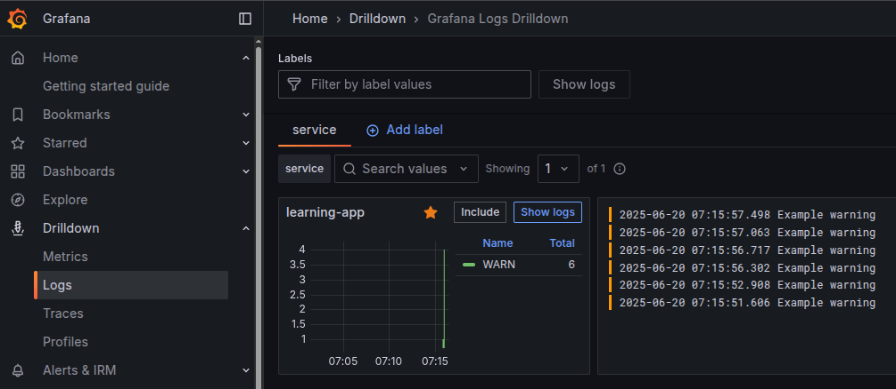

# Introduction to OpenTelemetry

[OpenTelemetry (OTEL)](https://opentelemetry.io/) is an open-source
observability framework for cloud-native software. It provides a standard for
collecting, processing, and exporting telemetry data such as traces, metrics,
and logs, from applications. By using OpenTelemetry, you can gain deep insights
into the performance and behavior of your distributed systems, making it easier
to monitor, troubleshoot, and optimize your applications.

OpenTelemetry is vendor-agnostic and supports integration with many popular
observability backends, including [Grafana](https://grafana.com/),
[Jaeger](https://www.jaegertracing.io/), [Zipkin](https://zipkin.io/),
[Prometheus](https://prometheus.io/), and others. It is a unified standard that
simplifies the process of instrumenting code and collecting telemetry data,
enabling to build robust monitoring and tracing solutions with small effort.

In the context of web frameworks like BlackSheep, OpenTelemetry can be used to
automatically trace incoming requests, outgoing HTTP calls, and other
operations, providing end-to-end visibility into your application's execution
flow.

/// note | Tutorial on self-hosted monitoring stack.

For a tutorial on how to self-host a full monitoring stack in a single node of
a Kubernetes cluster (which is fine for non-production environments), and to
know more about OpenTelemetry and the OTLP protocol, you can read:
[_K8s Studies on Monitoring_](https://robertoprevato.github.io/K8sStudies/k3s/monitoring/).
It includes a working example of BlackSheep application that sends telemetries
to an OpenTelemetry Collector.

///

## Enabling OpenTelemetry in BlackSheep

BlackSheep offers built-in support for OpenTelemetry since version `2.3.2`, but
it is anyway simple to use OpenTelemetry in previous versions of the web
framework.

/// tab | Since v2.3.2

To enable OpenTelemetry integration starting with version `2.3.2`, you can
import common functions from the `blacksheep.server.otel` namespace.

```python
# To use exporters of your choice:
from blacksheep.server.otel import use_open_telemetry

# To use a service that supports the OpenTelemetry Protocol:
from blacksheep.server.otel.otlp import use_open_telemetry_otlp

```

Follow the instructions below.

---

///

/// tab | Before v2.3.2

To enable OpenTelemetry integration before version `2.3.2`, follow the example
included in [BlackSheep-Examples/otel](https://github.com/Neoteroi/BlackSheep-Examples/tree/main/otel).

- Copy the code in the [`otel/__init__.py`](https://github.com/Neoteroi/BlackSheep-Examples/blob/main/otel/otel/__init__.py)
  and [`otel/otlp.py`](https://github.com/Neoteroi/BlackSheep-Examples/blob/main/otel/otel/otlp.py) folder
  into your own system.
- Follow the instructions in the repository and the information below.

---

///

The common code consists of a middleware that enables tracing of all web requests
and exceptions (`OTELMiddleware`), logging instrumentation, and application
callbacks to ensure logs are collected and flushed properly.

The common code is _vendor-agnostic_ because it is intentionally abstracted
from specific observability services. Depending on the service you want to use,
you need to configure specific _exporters_, which are classes responsible to
send collected logs and traces towards a certain OTEL service. If the service
you intend to use supports the OpenTelemetry Protocol (OTLP), you can use the
`use_open_telemetry_otlp` method imported from `otlp.py`. This method uses
`OTLP` exporters, which rely on standard environment variables. The
documentation below provides an example on how to use Grafana in such scenario.

## Requirements

```bash
pip install opentelemetry-distro

opentelemetry-bootstrap --action=install
```

To work using the OTLP protocol (for instance, with [Grafana](https://grafana.com/)),
install the `opentelemetry-exporter-otlp` package:

```bash
pip install opentelemetry-exporter-otlp
```

Install other dependencies depending on the backend service you intend to use.
For instance, for *Azure Application Insights*, install `azure-monitor-opentelemetry-exporter`:

```bash
pip install azure-monitor-opentelemetry-exporter
```

---

## Example: Grafana

There are several ways to integrate with Grafana. This documentation describes
only manual setup using environment variables for the OTLP protocol. This
approach is flexible because it only requires outgoing HTTP connectivity, and
works well in scenarios where installing agents like `Grafana Alloy` is not
easy or not possible (e.g. cloud `PaaS` services).

- Install the required dependencies like described above.
- Obtain environment variables for the OTLP protocol, using the _OpenTelemetry
  getting started guide_ and the option _Send OpenTelemetry data directly to
  the Grafana Cloud OTLP endpoint._


Obtain the environment variables with the following names:

```
OTEL_RESOURCE_ATTRIBUTES="..."
OTEL_EXPORTER_OTLP_ENDPOINT="..."
OTEL_EXPORTER_OTLP_HEADERS="..."
OTEL_EXPORTER_OTLP_PROTOCOL="http/protobuf"
```


Configure env variables for your application.

/// admonition | Python dot-env.
    type: tip

One way to handle env variables for local development is using the
`python-dotenv` library and storing the env variables in a `.env` file, then
load variables using the `load_dotenv` function imported from `dotenv`.
In such case, ensure that `.env` is included in `.gitignore`.

```python
from dotenv import load_dotenv

load_dotenv()
```

///

Enable data collection:

```python
from blacksheep import Application
from blacksheep.server.otel.otlp import use_open_telemetry_otlp

app = Application()

use_open_telemetry_otlp(app)
```

A trace is produced for each web request and for all handled and unhandled
exceptions. For unhandled exceptions, OpenTelemetry includes the full
stacktrace of the exception.


## Example: Azure Application Insights

This documentation describes how to integrate with an Azure Application Insights
service.

- Install the required dependencies like described above.
- Obtain the connection string of an [Azure Application Insights service](https://learn.microsoft.com/en-us/azure/azure-monitor/app/connection-strings).
- Configure tracing like in the following example:

```python
# reusable code
from azure.monitor.opentelemetry.exporter import (
    AzureMonitorLogExporter,
    AzureMonitorTraceExporter,
)
from blacksheep import Application
from blacksheep.server.otel import use_open_telemetry


def use_application_insights(
    app: Application,
    connection_string: str,
):
    """
    Configures OpenTelemetry for a BlackSheep application using Azure Application Insights.

    Sets up logging and tracing exporters for Azure Monitor using the provided connection string.

    Args:
        app: The BlackSheep Application instance.
        connection_string: Azure Application Insights connection string.
    """
    use_open_telemetry(
        app,
        AzureMonitorLogExporter(connection_string=connection_string),
        AzureMonitorTraceExporter(connection_string=connection_string),
    )


# app specific code:
app = Application()
use_application_insights(app, "YOUR_CONN_STRING")
```

Observe how web requests and errors are displayed:


## Logging dependencies

When using OpenTelemetry you can handle your own tracing explicitly.
The BlackSheep code includes an asynchronous context manager and example code
for granular control of tracing.

```python {linenums="1" hl_lines="9 4 11"}
from blacksheep.server.otel import logcall


@logcall("Example")
async def dependency_example():
    await asyncio.sleep(0.1)


@app.router.get("/")
async def home(request) -> Response:
    await dependency_example()
    return text("Hello, traced BlackSheep!")
```

---

The following screenshots illustrate how dependencies are displayed in Grafana
and Azure Application Insights:


/// admonition | Dependencies with Azure Application Insights.
    type: example

For Azure, use a decorator that sets the `az.namespace` information like in
the example provided in [_BlackSheep-Examples_](https://github.com/Neoteroi/BlackSheep-Examples/blob/main/otel/otel/azure.py).

///

## Working with spans

The provided `OTELMiddleware` ensures that a tracing context, called "span", is
created for each request and response cycle. To include additional information
to a web request cycle, obtain the current span like in the following example:

```python
from opentelemetry import trace


@app.router.get("/")
async def home(request) -> Response:
    span = trace.get_current_span()
    span.set_attribute("custom.info", "This is extra info for the request")
    return text("Hello, traced BlackSheep!")
```

`trace.get_current_span()` works by using context variables (such as Python's
[`contextvars.ContextVar`](https://docs.python.org/3/library/contextvars.html))
under the hood. Context variables allow each asynchronous task or coroutine to
have its own independent context, so the current span is correctly tracked even
when code is running concurrently. This ensures that in async code, each task
sees its own current span, avoiding conflicts or leaks between concurrent
executions.

Custom events can be included in the current span:

```python
    span = trace.get_current_span()
    span.add_event(
        "Custom event: home handler called",
        {"data": "Example"},
    )
```

Beware that not all OpenTelemetry services support custom events.

## Logs instrumentation

The common code includes instrumentation for built-in `logging`. It configures
instrumentation to send logs to the OpenTelemetry service only with priority
higher or equal to `WARNING`.

```python
@app.router.get("/")
async def home(request) -> Response:
    logger.warning("Example warning")
```



To filter by a different priority, set a different level on the root logger:

```python
import logging


logging.getLogger().setLevel(logging.INFO)
```


## Service information

The common code includes a function, named `set_attributes`, which can be used
to set the `OTEL_RESOURCE_ATTRIBUTES` environment variable with service metadata
for OpenTelemetry.

This method prepares and sets the OpenTelemetry resource attributes:
service name, namespace, and environment, by updating the corresponding
environment variable. This enables OpenTelemetry instrumentation to correctly
identify and categorize telemetry data for the service.

For more information on standard attributes, refer to: [_Environment Variable
Specification_](https://opentelemetry.io/docs/specs/otel/configuration/sdk-environment-variables/).
