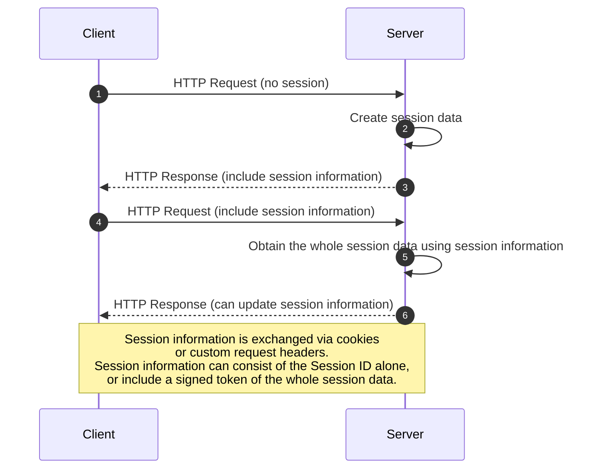
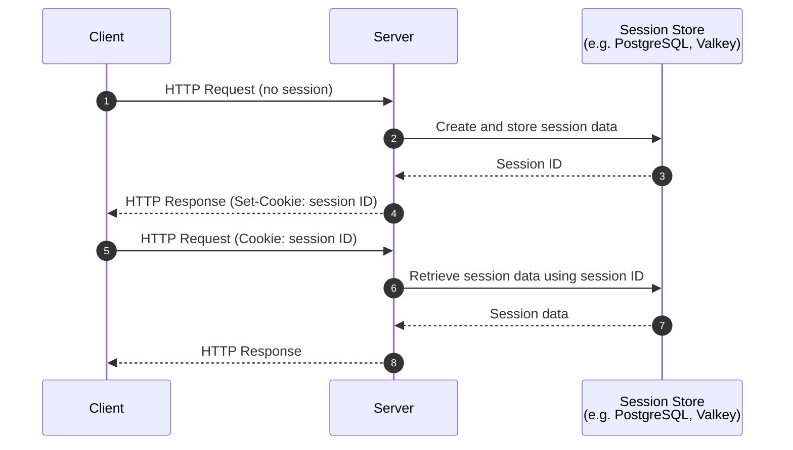

# Sessions

Sessions are a mechanism used in web applications to persist user-specific data
across multiple requests. Since HTTP is a stateless protocol, each request from
a client is independent and does not retain information about previous
interactions. Sessions solve this by allowing the server to associate requests
with a particular user, typically by issuing a unique session identifier (often
stored in a cookie). This enables features like user authentication, shopping
carts, and personalized experiences.

This page describes built-in features to support sessions.

---

/// admonition | Sessions have been improved in `2.4.0`.
    type: info

The built-in sessions have been improved in version `2.4.0` to support any kind
of store. Older versions of BlackSheep included built-in support for sessions
but offered only built-in support for storing sessions information in cookies.
Since version `2.4.0`, any kind of store is supported, through the
`SessionStore` interface described below in this page.

///

## Sessions flows

The diagram below illustrates an high-level overview of how session works:



The session information exchanged with the client can either be a _session ID_,
—in this case the actual session data is stored server-side— or the entire
session data contained within a digitally signed token.

### Example: session data stored in dedicated service

The diagram below illustrates a more specific scenario, in which the server
exchanges with the client only a _session ID_, and the whole session data is
stored in a third-party service such as [PostgreSQL](https://www.postgresql.org/)
server, or [Valkey](https://github.com/valkey-io/valkey) server.



In this scenario, Session ID is exchanged between client and server via
cookies. Full session data is stored in a third-party store. The server uses
the session ID from the cookie to restore session data for each request.

In alternative to cookies, it is possible to use other ways to exchange
information between the client and the server, such as custom response and
request headers.

## Enabling sessions, with cookie store

To enable sessions and have sessions stored in cookies, use the
`app.use_sessions` method as in the example below:

```python
from blacksheep import Application, Request, get, text

app = Application()


app.use_sessions("<SIGNING_KEY>")


@get("/")
def home(request: Request):
    session = request.session

    session["example"] = "Lorem ipsum"

    return text(session["example"])
```

The `<SIGNING_KEY>` is a key used to digitally sign and protect from tampering,
this key must be protected and not shared with clients.

For this scenario, the `use_sessions` method accepts the following parameters:

| Name            | Description                                                                            | Defaults to                           |
| --------------- | -------------------------------------------------------------------------------------- | ------------------------------------- |
| secret_key      | Required secret key used for signing cookies.                                          | N/A                                   |
| session_cookie  | Optional session cookie name.                                                          | "session"                             |
| serializer      | Optional `blacksheep.sessions.Serializer` to serialize and deserialize session values. | `blacksheep.sessions.JSONSerializer`  |
| signer          | Optional `itsdangerous.Serializer` to sign and encrypt the session cookie.             | `itsdangerous.URLSafeTimedSerializer` |
| session_max_age | Optional session max age, in **seconds**.                                              | `None`                                |

```python
    def use_sessions(
        self,
        store: str,
        *,
        session_cookie: str = "session",
        serializer: SessionSerializer | None = None,
        signer: Signer | None = None,
        session_max_age: int | None = None,
    ) -> None:
        ...
```

The built-in sessions middleware uses
[`itsdangerous`](https://itsdangerous.palletsprojects.com/en/1.1.x/) to sign,
encrypt, and verify session cookies. Refer to [data
protection](dataprotection.md) for more information on how tokens are signed
and encrypted.

Before version `2.4.0`, BlackSheep offered built-in support only for sessions
stored entirely on the client side, in cookies. Using sessions with a different
store required custom code.

/// admonition | Cookies and cross-site request forgery.
    type: danger

When you store sessions in cookies on the client side, web applications must
implement [Anti-Forgery validation](anti-request-forgery.md) to prevent
Cross-Site Request Forgery (XSRF/CSRF).

**Why?**

Cookies are sent automatically by browsers with every request to your
domain, making your app vulnerable to Cross-Site Request Forgery (CSRF)
attacks, if information in cookies is used to authenticate requests and your
application does not implement [Anti-Forgery
validation](anti-request-forgery.md).

**How?**

Common anti-forgery mechanisms include:

- CSRF tokens: Generate a unique token per session/request and require it in
  forms or headers.
- SameSite cookies: Set your session cookie with `SameSite=Strict` or
  `SameSite=Lax` to limit cross-site requests.
- Custom headers: For APIs, use and require a custom header (e.g.,
  `X-Session-ID`) that browsers do not send cross-origin. In a user-defined
  `SessionStore` type, you can rely on a custom request and response header to
  exchange information with clients —updating your client code accordingly.

///

## Enabling sessions, with custom store

Starting from `2.4.0`, the built-in classes for sessions include support for
custom stores. To enable sessions and have sessions stored in the desired way,
implement a type of `SessionStore` like in the following example:

```python
from blacksheep.sessions.abc import Session, SessionStore


class MySessionStore(SessionStore):

    async def load(self, request: Request) -> Session:
        """Load the session for the given request."""
        ...

    async def save(
        self, request: Request, response: Response, session: Session
    ) -> None:
        """Save the session related to the given request-response cycle."""
        ...
```

And then call the `app.use_sessions` passing as first argument an instance of
your custom store type.

```python
from blacksheep import Application, Request, get, text

from myapp.sessions import MySessionStore

app = Application()


app.use_sessions(MySessionStore(...))
```

When this option is used, all other parameters to the `use_sessions` method are
ignored.

### InMemorySessionStore

Since version `2.4.0`, an `InMemorySessionStore` is included in the
`blacksheep.sessions.memory` namespace.

```python
from blacksheep.sessions.memory import InMemorySessionStore
```

This kind of store is an in-memory implementation of `SessionStore` for
managing user sessions. The session ID is transmitted in cookies, to restore
the same session information across request-response cycles.

This session store keeps session data in a Python dictionary, mapping session
IDs to session data. It is suitable for development and testing environments,
but not recommended for production use as session data will be lost when the
application restarts and is not shared across multiple processes or servers.

## Using sessions

When sessions are enabled, they are always populated for the `request` object,
and can be accessed through the `request.session` property.

The sessions middleware takes care of saving session information whenever the
session is modified.

```python
@get("/")
def home(request: Request):
    session = request.session

    # setting a value
    session["example"] = "Lorem ipsum"

    # getting a value
    foo = session.get("foo")

    # getting a value with default
    foo = session.get("foo", 100)

    # getting a value (can produce KeyError)
    foo = session["foo"]

    # checking if a key is set
    if "something" in session:
        ...

    # deleting a key
    del session["something"]

    # update with many values
    session.update({"a": 1, "b": 2})

    return text(session["example"])
```
