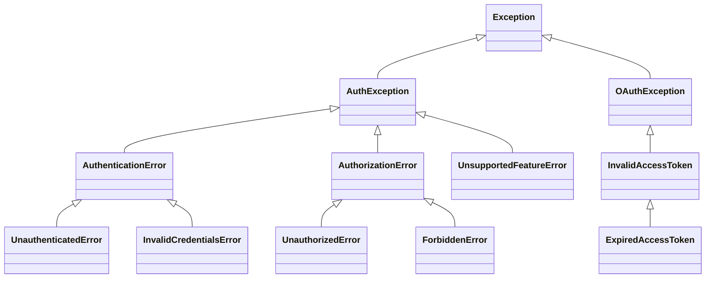

# Errors

This page is a reference for all exceptions raised by GuardPost.

## Exception table

| Exception | Module | Description |
|-----------|--------|-------------|
| `AuthException` | `guardpost` | Base class for all GuardPost exceptions |
| `AuthenticationError` | `guardpost` | Base class for authentication failures |
| `UnauthenticatedError` | `guardpost` | Raised when identity is `None` or missing |
| `InvalidCredentialsError` | `guardpost.protection` | Raised for invalid credentials; triggers rate-limiting |
| `AuthorizationError` | `guardpost` | Base class for authorization failures |
| `UnauthorizedError` | `guardpost` | User is not authenticated (no identity) |
| `ForbiddenError` | `guardpost` | User is authenticated but lacks the required permission |
| `OAuthException` | `guardpost.jwts` | Base OAuth-related exception |
| `InvalidAccessToken` | `guardpost.jwts` | JWT is malformed or the signature / claims are invalid |
| `ExpiredAccessToken` | `guardpost.jwts` | JWT has a valid signature but is past its `exp` claim |
| `UnsupportedFeatureError` | `guardpost` | Raised when an unsupported feature is requested (e.g. unknown key type) |

## Exception hierarchy



## Exception details

### `AuthException`

The root base class for all exceptions defined by GuardPost. Catching
`AuthException` will catch any GuardPost error.

```python {linenums="1"}
from guardpost import AuthException

try:
    await strategy.authenticate(context)
    await authz_strategy.authorize("policy", context.identity)
except AuthException as exc:
    print(f"GuardPost error: {exc}")
```

---

### `AuthenticationError`

Base class for errors that occur during the authentication phase.

---

### `UnauthenticatedError`

Raised when code that requires an authenticated identity finds `None`. Typically
raised internally by `AuthorizationStrategy` when `identity` is `None`.

```python {linenums="1"}
from guardpost import UnauthenticatedError

try:
    await strategy.authorize("admin", None)
except UnauthenticatedError:
    # HTTP 401 — client must authenticate first
    ...
```

---

### `InvalidCredentialsError`

Raised by `AuthenticationHandler` implementations when credentials are present
but invalid (wrong password, revoked key, etc.). This exception enables the
`RateLimiter` to count the failure. See [Brute-force protection](./protection.md).

```python {linenums="1"}
from guardpost.protection import InvalidCredentialsError

raise InvalidCredentialsError("Invalid password for user 'alice'.")
```

---

### `AuthorizationError`

Base class for errors that occur during the authorization phase. Catching this
handles both `UnauthorizedError` and `ForbiddenError`.

---

### `UnauthorizedError`

Raised by `AuthorizationStrategy` when the identity is `None` (the request is
not authenticated). Map to HTTP **401** in web applications.

---

### `ForbiddenError`

Raised by `AuthorizationStrategy` when the identity is set but a `Requirement`
called `context.fail(...)`. Map to HTTP **403** in web applications.

```python {linenums="1"}
from guardpost.authorization import ForbiddenError, UnauthorizedError

try:
    await strategy.authorize("admin", identity)
except UnauthorizedError:
    return response_401()
except ForbiddenError:
    return response_403()
```

---

### `OAuthException`

Base class for OAuth / OIDC related exceptions. Available in the `guardpost.jwts`
module (requires `pip install guardpost[jwt]`).

---

### `InvalidAccessToken`

Raised when a JWT cannot be validated — the token is malformed, the signature
does not match, or the claims (issuer, audience, etc.) are invalid.

```python {linenums="1"}
from guardpost.jwts import InvalidAccessToken

try:
    claims = await validator.validate_jwt(raw_token)
except InvalidAccessToken as exc:
    print(f"Token rejected: {exc}")
```

---

### `ExpiredAccessToken`

A subclass of `InvalidAccessToken`, raised specifically when the JWT's `exp`
claim is in the past. Clients should respond by refreshing their token.

```python {linenums="1"}
from guardpost.jwts import ExpiredAccessToken, InvalidAccessToken

try:
    claims = await validator.validate_jwt(raw_token)
except ExpiredAccessToken:
    print("Token expired — please refresh.")
except InvalidAccessToken:
    print("Token is invalid.")
```

---

### `UnsupportedFeatureError`

Raised when GuardPost encounters a configuration or request that requires a
feature it does not support — for example, a JWKS key with an unknown `kty`
value.
